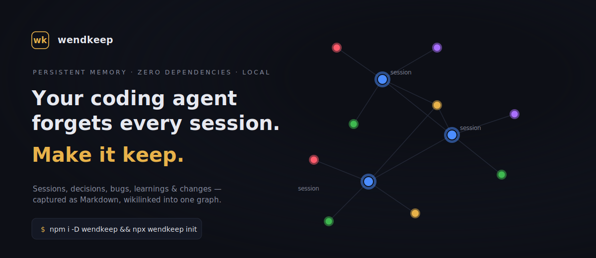

# wendkeep

[Português](README.pt-BR.md) · **English**

> **Your AI coding agent forgets every session. wendkeep makes it remember — in the Obsidian vault you already use.**

[](https://www.npmjs.com/package/wendkeep)


[](docs/index.html)

**In the graph:** 🔵 session · 🟣 decision · 🔴 bug · 🟢 learning · 🟡 change — every note, backlinked.

**A persistent‑memory harness for AI coding agents, built on your Obsidian vault.** Every Claude Code **and Codex** session is captured turn‑by‑turn into local Markdown — `init` wires both (Codex asks you to approve its hooks once; `import` backfills past sessions either way) — with token/cost tracking, auto‑extracted decisions, bugs and learnings, and a curated memory layer injected back at the start of the next session. On top of that memory core sits a native, zero‑dependency **change lifecycle** (spec → change → TDD → sensor‑gated archive) that keeps intent, work and proof wikilinked in one graph. 100% local, open‑core.

```bash
npm i -D wendkeep && npx wendkeep init      # captures from the next session on
npx wendkeep import                          # backfill past Claude + Codex sessions
```

**▶ Interactive demo:** [`docs/index.html`](docs/index.html) — a self-contained page with the live knowledge‑graph hero. It lives in the [GitHub repo](https://github.com/rogersialves/wendkeep/tree/main/docs) (the npm tarball ships only the runtime), so clone or download `docs/` to open it locally or serve it on any static host. The image above is a static render of it.

> **From one real production vault** (`npx wendkeep stats`): **308** sessions · **1,696** prompts · **$4,836** captured across **46 active days** (Jan–Jul 2026) · **15** models — every one a note in the graph.

<!-- Optional: drop a real Obsidian graph screenshot at docs/assets/graph.png and add it here (see docs/21-graph-screenshot.md). -->

> Extracted from a system in daily production use: the capture engine, cost tracking and graph wiring are battle‑tested; the cross‑platform installer (`wendkeep init`) and the native change loop are the newer parts. See [`docs/`](https://github.com/rogersialves/wendkeep/tree/main/docs) for the project's strategy and decision log.

---

## The problem: the context dies when the window closes

Decisions, dead ends, the reason you chose X over Y — gone next session. The pieces to fix that exist but are scattered (qmd‑sessions, memsearch, Nexus, hand‑written hooks). wendkeep ships them as one turnkey package that writes into a knowledge graph **inside the Obsidian vault you already use** — no manual setup, no snapshot to keep in sync.

| | |
|---|---|
| **Capture** — every turn, on disk | `SessionStart` / `Stop` hooks write each session to a dated Markdown note: prompts, iterations, files touched, wikilinks. |
| **Derive** — decisions, bugs, learnings | Pulled from the transcript into their own notes, backlinked to the session. Your history becomes navigable, not archival. |
| **Recall** — injected back | A budget‑capped `CORE` + `DIGEST` and every open change are fed to the agent at the next `SessionStart`. It resumes where it left off. |
| **Cost** — what it all cost | Per‑model, cache‑aware token pricing per session — plus `cost --trend` with a run‑rate projection across the whole vault. |
| **Multi‑agent** — one vault, both agents | `init` wires the session hooks into `.claude/settings.json` *and* `.codex/hooks.json`, and every note is tagged with the agent that wrote it: Claude Code is detected from its environment, anything else is recorded as Codex. One shared graph, whichever agent you are in. |
| **Local‑first** — no cloud, no account | Everything is plain Markdown on your disk. An optional MCP server (`@bitbonsai/mcpvault`) lets the agent read/write the vault. |

## Requirements

- Node.js ≥ 18
- An AI coding agent with hooks. `init` wires **Claude Code** and **Codex** automatically — Codex gets the seven hooks its event model supports and enumerates them untrusted, so approve its “Hooks need review” prompt once at startup (see [Notes & roadmap](#notes--roadmap))
- Obsidian (to view the graph) — optional but the point

## Install & set up

```bash
# in your project
npm install --save-dev wendkeep   # or: npm install -g wendkeep
npx wendkeep init
```

`wendkeep init` is interactive and **idempotent**. It will:

1. Create the vault folder taxonomy and a templated `README.md` (default vault: `<project>/.<project-name>-vault`, e.g. `.MyApp-vault`; override with `--vault`).
2. Write a provider-neutral **`.wendkeep.json`** binding at the project root and a matching `.brain/PROJECT.json` marker in the vault, then merge the session hooks into **`.claude/settings.json`**. The binding is provider-neutral by design: any agent resolves the same vault from its session `cwd`, with no machine-global environment variable. Older registrations already in `.claude/settings.json` are adopted automatically.
3. Wire the Codex session hooks in **`.codex/hooks.json`** — seven of the twelve: `brain-inject` + `session-start` on `SessionStart`, `session-ensure` + `change-context` on `UserPromptSubmit`, `session-stop` + `change-nag` on `Stop`, `subagent-stop` on `SubagentStop`, always in the `npx wendkeep hook <name>` form. The other five are left out because Codex offers no equivalent payload, tool *or* event: `change-guard` (a `PreToolUse` gate reading `tool_input.command`, but Codex's `exec` carries `tool_input` as a raw string rather than an object, so the gate would fail *open*), `change-warn` (a `PostToolUse` nudge resolving `tool_input.file_path`, a field `apply_patch`'s envelope does not carry — nothing to resolve, and nothing to gate), `plan-capture` (there is no `ExitPlanMode`; `update_plan` is a running TODO list, not an approval), `decision-capture` (`AskUserQuestion` is a Claude-only tool) and `task-log` (`TaskCompleted` is not in Codex's event enum). See [Notes & roadmap](#notes--roadmap) for the per-hook detail. The merge is non-destructive, on the same discipline as `settings.json`: it recognizes an already-wired group and never duplicates on re-init, preserves third-party hooks, saves a `.bak`, and `--force` updates `timeoutSec`/`statusMessage` in place; an unparseable `.codex/hooks.json` is left untouched with the merge written to `.codex/hooks.json.new`. **Codex enumerates every hook as untrusted and runs none of them until you approve the “Hooks need review” prompt at startup — `init` cannot pre-approve them**, and it prints a warning saying so. Anyone who already had hand-written wendkeep hooks in Codex gets one re-review prompt: `init` migrates the legacy `timeout` key (which Codex neither rejects nor reads, falling through to a 600s default) to `timeoutSec`, and that changes the hook's hashed identity.
4. Add the **`wendkeep-vault`** MCP server to `.mcp.json` so the agent can read/write the vault. Skip with `--no-mcp` — e.g. when the agent already has a vault MCP. (`--no-mcp` skips *only wendkeep's own* MCP; companion MCPs still follow `--companions`.)
5. Offer to pin **companion** plugins/MCP (multi-choice; **none** pre-checked — wendkeep is a neutral harness and presumes no third-party plugin). Each is wired the most agent-agnostic way it supports:
   - **`context-mode`** — context optimizer + FTS5 memory, wired as a Claude Code plugin. It ships its own MCP server, so wendkeep deliberately adds no `.mcp.json` entry (registering both cold-started two servers at once). On non-Claude agents, add the MCP by hand: `npx -y context-mode`.
   - **`understand-anything`** — project domain graph, via a `understand-inject` SessionStart hook that injects the graph when generated.
   - **`caveman`** — token-compression mode; runs its own cross-agent installer on non-Claude agents.
   - **`dotcontext`** — *legacy, not recommended, and hidden from the picker.* wendkeep's native a2 loop (`change` / `verify` / gate) already does its job, so installing it **duplicates the harness**. Reachable only via an explicit `--companions dotcontext` for anyone already invested (tune with `--dotcontext-mcp` / `--dotcontext-hooks`).

   Control with `--companions <csv>` or `--no-companions`. The Claude Code plugin layer (`extraKnownMarketplaces` + `enabledPlugins`) is wired as a bonus where the companion has one.
6. Install a **color system** into the vault's `.obsidian/`: a CSS snippet that accents notes by type (session/decision/bug/learning, via the `cssclasses` the hooks emit) plus graph color groups by folder. Non-destructive merge into `appearance.json`/`graph.json`; skip with `--no-colors`. Re-apply it any time on an existing vault with `wendkeep theme sync` — Obsidian owns `graph.json` and can drop the color groups (a grey graph); the re-sync restores them without a full re-`init`.
7. Seed the **curated memory layer**: `.brain/CORE.md` (the hand-curated hot layer, with the 3 required sections) and `.brain/COMPACTION_PROTOCOL.md` (the protocol guide). The auto layers (`DIGEST.md`, `index.jsonl`) are generated by the hooks. Validate the curated layer with `wendkeep validate-memory` (cap 25 lines, 3 sections, no secrets/PII).
8. Seed the **definitions + skills layer**: `.brain/agents/` + `.brain/skills/` (versioned source of truth), including the native process skills `wk-workflow` / `wk-tdd` / `wk-debugging` / `wk-brainstorming` / `wk-planning` / `wk-verify` (some ship templates — e.g. `wk-verify`'s `verdict-template.json` + reviewer prompt). `init` runs `wendkeep sync-defs` for you, delivering the skills to `.claude/skills/` and `.agents/skills/`, and the agent definitions (`.brain/agents/*.toml`) to `.codex/agents/`, plus a managed section in `AGENTS.md` that indexes the skills for Codex; `sync-defs --check` detects stale copies (re-run `sync-defs` after editing `.brain`).
9. Seed the **change/spec lifecycle**: the `07-Specs/` + `08-Mudanças/` folders and a native `wendkeep.sensors.json` — a critical `memory-validation` sensor (`npx wendkeep validate-memory`) plus one for each of `typecheck` / `test` / `lint` / `build` found in your `package.json`. Add your own with `wendkeep sensors add`. Drives `wendkeep change` / `wendkeep verify` — see **Change lifecycle** below.

```bash
npx wendkeep init --vault "~/vaults/work" --project . --yes   # non-interactive (no companions unless you ask)
npx wendkeep init --companions "context-mode,understand-anything" --yes
npx wendkeep init --no-companions --no-mcp --yes              # zero companions, no wendkeep MCP
```

### `init` options

| Flag | What it does |
|---|---|
| `--vault <path>` | Vault folder. Default `<project>/.<project-name>-vault`; interactive init asks. Point it at an existing vault to install into it. |
| `--project <path>` | Project root to wire (default: current directory). |
| `--locale <pt-BR\|en>` | Vault language — folder names, scaffold, skills. Interactive init asks; locked at init. |
| `--companions <csv>` | Companions to pin: `context-mode,caveman,understand-anything` (default: **none** — opt in explicitly; `dotcontext` is legacy). |
| `--no-companions` | Pin no companions. |
| `--no-mcp` | Skip **wendkeep's own** vault MCP (`wendkeep-vault`). Companion MCPs still follow `--companions`. |
| `--no-colors` | Skip the Obsidian color system (`.obsidian` snippet + graph groups). |
| `--yes`, `-y` | Non-interactive; accept defaults (skips the language / vault / companion prompts). |
| `--force` | Overwrite existing wendkeep config blocks. |

Then open the vault in Obsidian, send a test prompt in your agent, and confirm a note appears under `02-Sessões/…` (or `02-Sessions/…` for an `en` vault).

### Project isolation

Each project owns a `.wendkeep.json` containing a stable `projectId` and its vault path.
Relative paths (for example `.NutriGymBrain`) are resolved from the project root; absolute
paths are also supported. Hooks search upward from the agent's `cwd`, so nested packages use
the nearest binding. The vault carries the same identity in `.brain/PROJECT.json`; a mismatch
is rejected before any session is written. If no binding exists, hooks fail closed and never
create the historical `~/wendkeep-vault` fallback.

`OBSIDIAN_VAULT_PATH` remains only as legacy/manual CLI compatibility. It is not used to
route automatic Codex or Claude hooks and a project-local binding overrides an inherited
machine value.

## Updating

Because the hooks live inside the installed package, upgrade the package and re-run the
idempotent init. The init step creates/migrates the provider-neutral project binding:

```bash
npm install --save-dev wendkeep@latest
npx --no-install wendkeep init --project . --vault <your-vault> --yes
npx --no-install wendkeep sync-defs --project . --reseed
npx --no-install wendkeep doctor --project .
```

Restart Codex and Claude Code after reseeding their generated skills.

## Commands

| Command | What it does |
|---|---|
| `wendkeep init` | Set up wendkeep in a project (vault taxonomy + settings + MCP + skills). |
| `wendkeep hook <name>` | Run a session hook; invoked by `settings.json` (reads agent JSON on stdin). |
| `wendkeep change <sub>` | Change lifecycle: `new <slug> [--simple]` / `use <slug>` (switch focus) / `continue <archived> <new>` / `bind <slug> --session <id>` / `list` (global backlog) / `show <slug>` / `status [slug]` / `done <id> [--change slug]` / `undone <id> [--change slug]` / `relink [--apply] [--json]` (repair change wikilinks; preview by default) / `diff [slug]` / `archive [slug] [--force]` / `abandon [slug]` (drop it, no ADR). `diff`, `archive` and `abandon` fall back to the active change when you omit the slug; bare `status` lists every open one. |
| `wendkeep verify [--deep] [--change s]` | Run the change's task sensors; `--deep` assembles the independent-verification package. `--change` targets a change other than the active one. |
| `wendkeep spec <sub>` | `list` / `show <capability>` generated contracts; `effective [--change <slug>] [--json]` (living contract + delta; defaults to the active change); `migrate`; `rebase [--accept-current]` (stops on conflicts unless you accept the living spec's side). |
| `wendkeep sensors <sub>` | `list` / `add <id> "<command>"` with `--severity` / `--type` / `--report` / `--name` / `--description` — view/edit `wendkeep.sensors.json` (JSON Schema shipped). |
| `wendkeep cost [opts]` | Aggregate AI-coding spend across the vault's sessions — total, by model, by day. `--since <date>` / `--top [N]` (priciest) / `--trend [day\|week\|month]` (+ run-rate projection) / `--write` (generate `00-Custo.md`) / `--json`. |
| `wendkeep cost rebuild [opts]` | Recalculate historical parent + subagent costs from `SESSION_REGISTRY`. Dry-run by default; `--apply` updates the notes and writes `.brain/COST_REBUILD.json`. Also `--session <id\|file>` / `--limit n` / `--json`. |
| `wendkeep stats [--vault P]` | One shareable line: sessions · prompts · spend · span · models (`--json`). |
| `wendkeep import [opts]` | **Retroactive memory** — backfill past **Claude + Codex** sessions into the vault (deduped by `session_id`). `--source all\|claude\|codex` / `--stamp-ids` / `--rescan-decisions` / `--from <dir>` / `--codex-from <dir>` / `--since d` / `--limit n` / `--dry-run` / `--json`. |
| `wendkeep session list\|show\|use` | List the multi-session registry, show one conversation, or move only the human focus in `CURRENT_SESSION.md`. |
| `wendkeep dashboard [--force]` | (Re)generate the vault's folder-filtered Bases + the `00-Dashboard` MOC. |
| `wendkeep note new --type bug\|learning "<title>"` | Create a **numbered** derived note (`BUG-`/`APR-NNNN`) in the month folder and print its vault path. `--date YYYY-MM-DD`. |
| `wendkeep renumber-decisions` | Renumber `04-Decisões` to `ADR-NNNN-<slug>` chronologically, move notes out of legacy `DIA N` subfolders into the month folder, and rewrite wikilinks. Preview by default; `--apply` / `--json`. |
| `wendkeep renumber-bugs` | Same for `05-Bugs` → `BUG-NNNN-<slug>`. |
| `wendkeep renumber-learnings` | Same for `06-Aprendizados`/`06-Learnings` → `APR-NNNN-<slug>`. |
| `wendkeep lesson add "t" "l"` | Record a project-local lesson (injected at the next SessionStart). |
| `wendkeep sync-defs` | Copy `.brain/agents\|skills` into `.codex/agents`, `.claude/skills`, `.agents/skills`; `--check` detects drift, `--reseed` refreshes the `wk-*` skills from the installed version's seeds. |
| `wendkeep validate-memory [path]` | Validate `.brain/CORE.md` (cap 25, 3 sections, no secrets/PII). |
| `wendkeep doctor [--vault P]` | Run a vault health check (integrity of sessions, registry, links). |
| `wendkeep --version` / `--help` | Version / usage. |

Session notes use one live `## Agentes, tokens e custos` snapshot. Main-agent and subagent hooks recompose it atomically, with costs, token dimensions, reasoning tokens and effort per model/source. Every hook that rewrites a session note takes a per-file lock and writes through a temp file + rename, so the `SubagentStop` fan-out (one hook run per subagent) can never leave a note half-written; a note whose frontmatter reads back damaged is left untouched rather than patched.

## Retroactive memory (`import`) — install today, remember yesterday

Install wendkeep into an existing project and it only remembers sessions **from now on**. `wendkeep import` fixes that: one command backfills your project's past **Claude & Codex** sessions into the vault — deduped, dated, with cost — so the graph starts full, not empty. It rebuilds each transcript as a full session note in its **real** date folder — frontmatter (tagged with the transcript's real provider), one iteration block per turn, cost + subagent telemetry, derived decision/bug/learning notes, finalized closing. An offline replay of the live capture flow, so an imported note is indistinguishable from a captured one.

```bash
wendkeep import --vault .myproject-vault --dry-run   # preview what would be imported (both agents)
wendkeep import --vault .myproject-vault             # write the notes
wendkeep import --vault .myproject-vault --source codex   # just Codex
```

- **Both agents by default** (`--source all`). Claude sessions come from `~/.claude/projects/<slug>/`; Codex rollouts from `~/.codex/sessions/**`, scoped to this project by the `cwd` recorded in each session (case- and separator-insensitive, subdirs included). Narrow with `--source claude` / `--source codex`.
- Every note records its **`session_id`** and **`provider`** in frontmatter (live capture and import alike). Backfill older notes with `wendkeep import --stamp-ids` (fills the id from the registry; idempotent).
- **Deduped** by `session_id` against the vault's `SESSION_REGISTRY` **and** existing notes' frontmatter — only sessions not already present are imported, and it never overwrites an existing note. Re-running is a no-op.
- **`--from <dir>`** / **`--codex-from <dir>`** point at the transcript folders explicitly (use if the auto-derived path misses). Also: `--since <date>`, `--limit <n>`, `--rescan-decisions`, `--json`.
- Once imported, `wendkeep cost` aggregates your entire history — retroactively, across both agents.

## Derived notes — numbered like ADRs (`note new`, `renumber-*`)

Decisions, bugs and learnings are **derived notes**: they live in the month folder of their tree (`<folder>/<year>/<MM-MON>/`) and carry a sequential id — `ADR-0001`, `BUG-0001`, `APR-0001`. One glance tells you what a note is and where it sits in the project's history. No day-level subfolders: a `DIA N` folder holding one note is noise, and it hides the note from folder-wide search.

**Creating one** (never write the file by hand — the command owns the number, the folder and the frontmatter):

```bash
wendkeep note new --type bug "login 500s when the token expires mid-refresh"
# → 05-Bugs/2026/07-JUL/BUG-0007-login-500s-when-the-token-expires-mid-refresh.md

wendkeep note new --type learning "a regex without /g only ever returns the first match"
# → 06-Aprendizados/2026/07-JUL/APR-0003-a-regex-without-g-only-ever-returns-the-first-match.md
```

It prints the created path, numbers from the current max (recursive scan), files it in the month folder for today (`--date YYYY-MM-DD` to override), and links the active session in `source:` so the graph stays connected. Agents get this rule injected at SessionStart — they call the command instead of guessing a filename.

**Reconnecting legacy notes.** Derived notes created by older versions carry no `source:` session and sit as islands in the graph. `wendkeep note relink` backfills them: each orphan inherits the modal source session of its type/month cohort (the session its non-orphan siblings already point to). Dry-run by default; `--apply` writes; notes with no sibling to infer from are skipped and reported.

**Migrating an existing vault.** Notes created before `0.41.0` have date-prefixed names (`2026-07-16-bug-<slug>.md`) and may sit in legacy `DIA N` subfolders. One command per tree renumbers them chronologically, moves them up into the month folder, and rewrites every wikilink across the vault:

```bash
# Bugs — 05-Bugs → BUG-NNNN
wendkeep renumber-bugs                  # preview: prints every from → to, writes nothing
wendkeep renumber-bugs --apply          # migrate

# Learnings — 06-Aprendizados → APR-NNNN
wendkeep renumber-learnings             # preview
wendkeep renumber-learnings --apply     # migrate

# Decisions — 04-Decisões → ADR-NNNN (since 0.30.0)
wendkeep renumber-decisions             # preview
wendkeep renumber-decisions --apply     # migrate
```

- **Preview is the default.** Nothing is written until `--apply` — read the `from → to` list first; that is where a mangled slug shows up, before it touches your files.
- **One tree at a time, on purpose.** There is no `renumber-all`: each folder is migrated and reviewed on its own.
- **Order is chronological**, derived from the note's date (frontmatter → filename prefix → folder), so `BUG-0001` is genuinely the oldest bug — not the first one the scanner happened to read.
- **Wikilinks are rewritten vault-wide** (full-path and basename forms, aliases preserved), the body's `type`/`bug:`/`apr:`/H1 are normalized, and emptied `DIA` folders are removed. **Idempotent**: a second `--apply` renames nothing. Close Obsidian while migrating, and commit the vault first if it is under git.

## Change lifecycle — the a2 loop (spec‑driven, native)

Beyond capturing sessions, wendkeep is a **harness**: a native, zero‑dependency loop that keeps *intent* (specs), *work* (changes) and *proof* (sensors) together in the vault, wikilinked into the Obsidian graph.

```
explore → propose → apply (TDD) → verify → archive
```

- **Propose** — `wendkeep change new <slug>` scaffolds `08-Mudanças/<slug>/` (`proposta.md`, `design.md`, `tarefas.md`; `--simple` skips the design). It becomes the global *current* change. When the change declares `spec_impact: required`, you author the delta yourself at `specs/<capability>/spec.md` — there is no placeholder to delete. Multiple changes may remain open: `change list`/`status` and the hooks show every pending one, while commands without `--change` act on the current one alone. `change use <slug>` changes focus and `change continue <archived> <new>` creates an auditable continuation.
- **Apply** — implement each `tarefas.md` task. Tag a task that needs machine proof with `[sensor:<id>]` — one sensor per task (a task carries a single sensor; split it in two if you need two) — and the requirement it satisfies with `[req:<ID>]`, of which a task may declare several.
- **Verify** — `wendkeep verify` runs the sensors your tasks declared (from `wendkeep.sensors.json` at the project root) and writes `evidencia.json`. A red `critical` fails the gate; a red `warning` is advisory. `verify --deep` builds a self-contained package with complete effective requirements (living contract + this change's delta), so the independent verifier never needs to reconstruct unarchived requirements from `07-Specs`. Every change needs a `verdict.json` to archive; `verify --deep` writes a trivial one automatically when the change declares no `[req:]`.
- **Archive** — `wendkeep change archive <slug>` **gates** on the evidence (blocks unless every declared critical sensor is green), promotes each capability's spec delta (`ADDED`/`MODIFIED`/`REMOVED`) into the living `07-Specs/<capability>.md`, moves the change to `_arquivo/`, and mints an ADR in `04-Decisões/`.

> The gate blocks unless the scaffold is filled, no task is open, evidence is fresh, and every declared requirement is covered. **`--force` waives exactly one of those — the open-task check — and is the human's call, never the agent's.** An unfilled scaffold, a red critical sensor, stale evidence, an orphan requirement or a missing verdict block regardless.

`wendkeep init` seeds process skills into the vault's `.brain/skills` and delivers identical copies to `.claude/skills/` and `.agents/skills/`; Codex gets the agent definitions (`.brain/agents/*.toml` → `.codex/agents/`) plus a managed section in `AGENTS.md` that indexes the skills. Every skill carries source hash/version metadata; `doctor` warns when reseed + agent restart is required.

### The loop in five minutes

```bash
npx wendkeep init --yes                        # vault + hooks + sensors + skills
npx wendkeep change new dark-mode              # proposta/design/tarefas — change is now active
```

Edit `tarefas.md` — tag proof and requirement per task:

```markdown
- [ ] 1.1 toggle persists across sessions [req:UI-1] [sensor:tests]
```

Declare the capability in `proposta.md` (`specs: [ui]`) and author its delta only in
`08-Mudanças/<slug>/specs/ui/spec.md`. `07-Specs` is generated/read-only. Then:

```bash
npx wendkeep change status                     # every open change + its pending tasks
npx wendkeep change list                       # same backlog, plus the archived ones
npx wendkeep change status dark-mode           # one screen for one change: specs / tasks / sensors / verdict
npx wendkeep spec effective --change dark-mode # living contract + this change's delta
npx wendkeep change done 1.1                   # tick a task from the CLI
npx wendkeep verify                            # run the declared sensors -> evidencia.json
npx wendkeep verify --deep                     # assemble the verification package
# the wk-verify skill (fresh, read-only pass) writes verdict.json
npx wendkeep change diff                       # preview what will land in 07-Specs
npx wendkeep change archive dark-mode          # gate: sensors + verdict + no open tasks
```

The archive promotes the delta into generated `07-Specs/ui.md`, mints an ADR, and the
Obsidian graph now links *session ↔ change ↔ requirement ↔ decision*. Every generated
artifact (`design`/`tarefas`) is born linking its change's `proposta` hub, and hand-authored
`spec.md` deltas are auto-linked on `verify`/`archive` — no change artifact is a graph island.
To backfill older changes that predate this, run `wendkeep change backlink --apply` (dry-run
without `--apply`). A change that names no `[req:]` still runs `verify --deep`, but skips the
`wk-verify` reading pass: the command writes a trivial verdict on its own and the sensor gate
is the real proof.

## How it works

```
agent session ──hooks──▶ wendkeep ──▶ Markdown in vault ──▶ .brain index + Obsidian graph
   (Claude/Codex)        (Node)      (02-Sessões/…)        (CORE+DIGEST, backlinks)
```

The agent's settings.json points each hook at `npx wendkeep hook …`; **in Claude Code** the change-lifecycle hooks instead run the installed script directly (`node` on `${CLAUDE_PROJECT_DIR}/node_modules/wendkeep/hooks/<name>.mjs`) when the package is present locally, skipping an npx resolve on every event. `.codex/hooks.json` mirrors the same groups with PascalCase event keys, but always uses the `npx` form (`${CLAUDE_PROJECT_DIR}` does not exist in Codex) and spells its timeout `timeoutSec` — a plain `timeout` is neither a field nor an error there, it silently falls through to a 600s default, so `init` migrates that legacy key in place. On `Stop`, wendkeep parses the session transcript, appends the turn, updates the token/cost table, and (idempotently) emits any decision/bug/learning notes. On `SessionStart` — startup, `/clear` and `/compact` — `brain-inject` injects back curated memory (CORE + DIGEST), every open change with its pending tasks, the global current-change marker, project lessons, and a `<wk_process>` router. Claude, Codex, or another agent can therefore resume work started elsewhere without hiding the rest of the backlog.

The archive **gate** blocks unless: the change scaffold is filled (G0), no task is open (G1), every declared critical sensor is green (with fresh evidence), and a `verdict.json` is present and current. `--force` waives G1 only — G0 is inescapable by design (a placeholder change forced through once minted a fake ADR), and no flag turns a red sensor or a missing verdict green. The agent is instructed never to use it on its own.

## Notes & roadmap

- **Vault folder names default to Portuguese** (`02-Sessões`, `04-Decisões`, …). Pass `wendkeep init --locale en` for an English vault (`02-Sessions`, `04-Decisions`, English scaffold/skills). The locale is a vault property, locked at init; parsers are bilingual so mixed content never breaks.
- **Search is keyword/frontmatter scoring**, not on‑device embeddings (that's on the roadmap).
- **Transcript formats are agent‑internal** and can change between agent versions; parsing is isolated but may need updates.
- Installer wires **both agents**: `.claude/settings.json` + `.mcp.json` for Claude Code, `.codex/hooks.json` for Codex. **Five hooks stay Claude‑only** because Codex has no equivalent payload, tool or event: `change-guard` (a `PreToolUse` gate that reads `tool_input.command`, but Codex's `exec` carries `tool_input` as a raw string rather than an object — the gate would fail *open*), `change-warn` (a `PostToolUse` nudge that resolves `tool_input.file_path`, which `apply_patch`'s envelope simply does not carry — nothing to resolve, and nothing to gate), `plan-capture` (no `ExitPlanMode` — `update_plan` is a running TODO list, not an approval), `decision-capture` (`AskUserQuestion` is Claude‑only) and `task-log` (`TaskCompleted` is not in Codex's event enum).
- **Codex hooks start untrusted.** They are enumerated but not executed until you approve the “Hooks need review” prompt; `init` cannot pre‑approve them (`--dangerously-bypass-hook-trust` is per‑invocation and stores no trusted hash). Trust is keyed to the hook's identity, so hand‑written wendkeep Codex hooks predating `0.46.0` — which ran at the 600s default because they used `timeout` instead of `timeoutSec` — cost one re‑review after `init` corrects the key. Expected, not a regression. `import --source codex` still backfills past Codex sessions either way.

---

## Stop re‑explaining your codebase every morning

```bash
npm i -D wendkeep && npx wendkeep init
```

**[Install from npm](https://www.npmjs.com/package/wendkeep)** · **[Star on GitHub](https://github.com/rogersialves/wendkeep)** — MIT · open‑core · your data never leaves your disk.

## License

MIT
