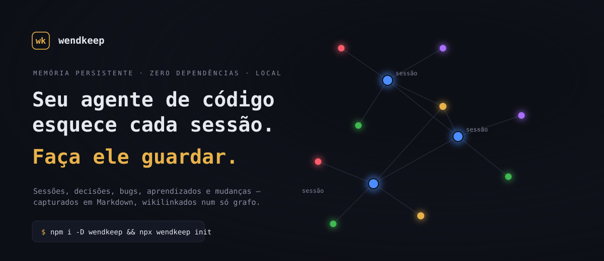

# wendkeep

**Português** · [English](README.en.md)

> **Seu agente de código esquece cada sessão. O wendkeep faz ele lembrar — no cofre Obsidian que você já usa.**

[](https://www.npmjs.com/package/wendkeep)


[](docs/index.pt.html)

**No grafo:** 🔵 sessão · 🟣 decisão · 🔴 bug · 🟢 aprendizado · 🟡 mudança — cada nota, com backlink.

**Memória persistente para agentes de código, construída sobre o seu cofre Obsidian.** Cada sessão do Claude Code e do Codex é capturada turno a turno em Markdown local — o `init` wira os hooks dos dois agentes (no Codex, valendo depois que você aprovar o prompt de confiança dele); o `import` recupera as sessões passadas — com rastreio de tokens/custo, decisões, bugs e aprendizados extraídos automaticamente. Esse plano sempre ativo é o **Keep Core**. Sobre ele, o **Wend Runtime** oferece um ciclo nativo e sem dependências (spec → change → TDD → archive com gate por sensor), selecionável pelos Perfis de Operação `OFF`, `FLOW`, `GUIDE`, `GOVERN` e `ASSURE`. 100% local, open‑core.

Na projeção das sessões, metadados internos terminais são removidos somente das respostas do
assistente; relatos do usuário permanecem. Tags XML-like são gravadas como texto escapado para não
serem interpretadas como HTML no modo de leitura do Obsidian.

O runtime está sendo separado em seis fronteiras físicas — `cli`, `harness`, `vault`, `mcp`,
`integrations` e `pi` — sem fragmentar a instalação. Os workspaces privados `cli`, `harness`,
`vault`, `mcp` e `integrations` agora são donos canônicos do runtime do executável, dos Perfis de
Operação/engine de sensores, do binding seguro/kernel da Shared Project Memory v2, do kernel de
configuração MCP e das regras puras de integração com Claude/Codex, respectivamente. O pacote raiz
expõe Harness e Vault em `wendkeep/harness` e `wendkeep/vault`; CLI, MCP e Integrations permanecem
superfícies privadas, acessíveis somente pelos binários, pelos efeitos de configuração do `init` e
pelas fachadas históricas. Os imports históricos continuam funcionando por
fachadas de compatibilidade e nenhum dado de sessão precisa ser migrado;
veja a [arquitetura modular](docs/pt-BR/architecture.md).

Na fase **0.66 Integrations Kernel**, `packages/integrations/src/` passa a ser a autoridade
canônica para o catálogo e a projeção de hooks, o envelope/provider, os filtros e parsers de
conteúdo e uso de transcripts e a identidade de sessão. Essas regras são puras: stdin/stdout,
ambiente, filesystem, Vault e registry continuam nas fachadas históricas. MCP e Integrations são
adapters irmãos sem dependência entre si, e a direção continua `cli/mcp/integrations/pi → Harness
→ Vault`. Hooks, sessões, paths, configs e schemas permanecem equivalentes; o workspace privado
`@wendkeep/integrations` segue dentro do único pacote publicado `wendkeep`, sem subpath público
`wendkeep/integrations`. A próxima fase é Pi.

Na fase **0.65 MCP Configuration Kernel**, `packages/mcp/src/config.mjs` passa a ser a autoridade
canônica para a entrada do MCPVault, seleção de servidores descritos pelo catálogo e merge de
`.mcp.json`. `src/taxonomy.mjs` fornece os descritores e `src/init.mjs` mantém somente a
orquestração de filesystem. Chaves e servidores existentes continuam preservados; JSON inválido
permanece byte a byte intacto e a proposta reconciliada vai para `.mcp.json.new`. O workspace
continua privado, sem subpath público `wendkeep/mcp` ou pacote npm separado.

Na fase **0.64 CLI Runtime**, `packages/cli/src/index.mjs` passa a concentrar help, versão,
seleção de Vault, apresentação de erros e dispatch lazy. `bin/wendkeep.mjs` fica reduzido ao
shebang e à invocação de `runCli()`. O tarball continua único e prova os aliases em um consumidor
isolado; não existe subpath público `wendkeep/cli` nesta fase.

Na fase **0.63 Harness FLOW Store**, `packages/vault/src/locale.mjs` passa a ser a fonte canônica
do locale e da taxonomia do cofre, enquanto `packages/harness/src/flow-store.mjs` passa a ser o
store durável canônico do FLOW. As fachadas históricas `hooks/locale.mjs` e
`hooks/vault-runtime-store.mjs` preservam a identidade dos exports. O Harness depende somente do
índice público do Vault — nunca o inverso —, sem migração de paths, schemas ou locks; o tarball
continua único, publicado pelo pacote raiz `wendkeep`.
Na contenção multiprocesso, a liberação transitória do lock público e de seus metadados owner/lease
é revalidada com budget/deadline limitados, inclusive na limpeza final; junctions, reparse points,
locks dangling e erros não transitórios continuam recusados antes de qualquer escrita.

```bash
npm i -D wendkeep && npx wendkeep init      # captura a partir da próxima sessão
npx wendkeep import                          # importa sessões passadas do Claude + Codex
```

**▶ Demo interativo:** [`docs/index.pt.html`](docs/index.pt.html) — uma página autocontida com o herói de grafo vivo. Ele vive no [repositório GitHub](https://github.com/rogersialves/wendkeep/tree/main/docs) (o tarball do npm leva só o runtime), então clone ou baixe o `docs/` pra abrir local ou servir em qualquer host estático. A imagem acima é um render estático dele.

> **De um cofre de produção real** (`npx wendkeep stats`): **308** sessões · **1.696** prompts · **US$ 4.836** capturados em **46 dias ativos** (jan–jul 2026) · **15** modelos — cada uma delas uma nota no grafo.

> Extraído de um sistema em uso diário de produção: o motor de captura, o rastreio de custo e a fiação do grafo são testados em batalha; o instalador multiplataforma (`wendkeep init`) e o ciclo de mudança nativo são as partes mais novas. Veja [`docs/`](https://github.com/rogersialves/wendkeep/tree/main/docs) para a estratégia e o log de decisões do projeto.

---

## O problema: o contexto morre quando a janela fecha

Decisões, becos sem saída, o motivo de você ter escolhido X em vez de Y — some na próxima sessão. As peças pra resolver existem, mas espalhadas (qmd‑sessions, memsearch, Nexus, hooks feitos à mão). O wendkeep entrega captura local e um Observer Docker opcional que mantém a memória completa navegável sem depender do Obsidian.

| | |
|---|---|
| **Captura** — cada turno, no disco | Os hooks `SessionStart` / `Stop` escrevem cada sessão numa nota Markdown datada: prompts, iterações, arquivos tocados, wikilinks. |
| **Deriva** — decisões, bugs, aprendizados | Puxados do transcript pra notas próprias, com backlink pra sessão. Seu histórico fica navegável, não arquivístico. |
| **Recall** — injetado de volta | O `CORE` canônico + o `SHARED_MEMORY` operacional, com budgets explícitos, são injetados no agente em `startup`, `/clear` e `/compact`; `DIGEST` fica como índice de recall profundo e fallback legado. |
| **Custo** — quanto tudo custou | Preço por modelo, ciente de cache, por sessão — mais `cost --trend` com projeção run‑rate no cofre inteiro; research previews sem tarifa final ficam como custo não estimado. |
| **Multi‑agente** — um cofre, os dois agentes | O `init` wira os hooks de sessão no `.claude/settings.json` *e* no `.codex/hooks.json`, e cada nota é marcada com o agente que a escreveu: o Claude Code é detectado pelo ambiente dele, qualquer outro é registrado como Codex. Um grafo só, esteja você em qual agente estiver. |
| **Local‑first** — sem nuvem, sem conta | Tudo é Markdown puro no seu disco. Um MCP opcional (`@bitbonsai/mcpvault`) deixa o agente ler/escrever o cofre. |
| **Observer local** — vários projetos, uma visão | `wendkeep observer` mantém no SQLite do volume Docker documentos, sessões, agentes, tokens, custos, chamadas e transcripts; cada projeto tem uma aba **Consumo** no painel read-only em `http://127.0.0.1:8787/`, sem token no loopback, e hooks indisponíveis usam outbox gzip sem bloquear a sessão, inclusive para transcripts grandes. |

Na migração histórica, o Observer preserva diferenças entre o total do frontmatter e o ledger em
linhas explícitas de reconciliação, e desambigua `session_id` duplicado por arquivo sem inventar
chamadas.

## Requisitos

O guard de escopo do Codex trata `commit`, `push`, `pull`, `merge`, `publish` e operações
destrutivas como capacidades independentes, inclusive dentro de comandos compostos.

- Node.js ≥ 18
- Um agente de código com hooks. O `init` wira o **Claude Code** e o **Codex** automaticamente — no Codex ele wira oito hooks compatíveis, incluindo o guard `PreToolUse` de escopo, e eles nascem *Untrusted*, então aprove o "Hooks need review" no primeiro startup (veja [Notas & roadmap](#notas--roadmap))
- Obsidian (pra ver o grafo) — opcional, mas é o ponto

## Instalar & configurar

```bash
# no seu projeto
npm install --save-dev wendkeep   # ou: npm install -g wendkeep
npx wendkeep init
```

O `wendkeep init` é interativo e **idempotente**. Ele:

1. Cria a taxonomia de pastas do cofre e um `README.md` templado (cofre padrão: `<projeto>/.<nome-do-projeto>-vault`, ex.: `.MeuApp-vault`; sobrescreva com `--vault`).
2. Grava um vínculo provider-neutral **`.wendkeep.json`** na raiz do projeto e o marcador correspondente `.brain/PROJECT.json` no cofre, e faz merge dos hooks de sessão no **`.claude/settings.json`**. O vínculo é provider-neutral de propósito: qualquer agente resolve o mesmo cofre pelo `cwd` da sessão, sem variável global da máquina. Registros antigos em `.claude/settings.json` são adotados automaticamente.
3. Wira os hooks de sessão do Codex em **`.codex/hooks.json`** — onze entradas compatíveis: `brain-inject` + `session-start` + `observer-publish` no `SessionStart`, `session-ensure` + `change-context` no `UserPromptSubmit`, `session-stop` + `observer-publish` + `change-nag` no `Stop`, `subagent-stop` + `observer-publish` no `SubagentStop` e `change-guard` no `PreToolUse` para `Bash`, `exec_command`, `apply_patch` e MCPs mutáveis, sempre na forma `npx wendkeep hook <name>`. O `observer-publish` mantém o snapshot sanitizado para o índice e também envia a autoridade SQL local com documentos, consumo e transcripts; não substitui o lifecycle local. O guard aceita payload Codex objeto, string crua e argv; compara a sessão com projeto, raiz Git, remoto, branch e worktree antes da mutação e nega alvo ausente ou divergente. Os outros quatro ficam de fora por falta de payload, ferramenta ou evento equivalente: `change-warn` (*nudge* `PostToolUse` sem `tool_input.file_path` confiável), `plan-capture` (não existe `ExitPlanMode`), `decision-capture` (`AskUserQuestion` é ferramenta só do Claude) e `task-log` (`TaskCompleted` não está no enum de eventos do Codex). No Codex, bloqueios usam `permissionDecision: "deny"`; `ask` não é emitido em `PreToolUse`. O merge é não‑destrutivo, preserva hooks de terceiros e continua migrando `timeout` para `timeoutSec`. **O Codex enumera todo hook como Untrusted e só executa depois que você aprovar o "Hooks need review" no startup — o `init` não consegue pré-aprovar**.
4. Adiciona o servidor MCP **`wendkeep-vault`** ao `.mcp.json` pro agente ler/escrever o cofre. Pule com `--no-mcp` — ex.: quando o agente já tem um MCP de cofre. (`--no-mcp` pula *só o MCP do próprio wendkeep*; os MCPs de companion seguem `--companions`.)
5. Oferece fixar plugins/MCP **companion** (múltipla escolha; **nenhum** pré-marcado — o wendkeep é um harness neutro e não presume plugin de terceiro). Cada um é wirado do jeito mais agnóstico que suporta:
   - **`context-mode`** — otimizador de contexto + memória FTS5, wirado como plugin do Claude Code. Ele traz o próprio servidor MCP, então o wendkeep de propósito não adiciona entrada no `.mcp.json` (registrar os dois subia dois servidores ao mesmo tempo). Em agentes não‑Claude, adicione o MCP à mão: `npx -y context-mode`.
   - **`understand-anything`** — grafo de domínio do projeto, via um hook `understand-inject` no SessionStart que injeta o grafo quando gerado.
   - **`caveman`** — modo de compressão de tokens; roda seu próprio instalador cross‑agent em agentes não‑Claude.
   - **`dotcontext`** — *legado, não recomendado, e oculto do seletor.* O loop a2 nativo do wendkeep (`change` / `verify` / gate) já faz o trabalho dele, então instalar **duplica o harness**. Alcançável só via um `--companions dotcontext` explícito, pra quem já usa (ajuste com `--dotcontext-mcp` / `--dotcontext-hooks`).

   Controle com `--companions <csv>` ou `--no-companions`. A camada de plugin do Claude Code (`extraKnownMarketplaces` + `enabledPlugins`) é wirada como bônus onde o companion tiver uma.
6. Instala um **sistema de cores** no `.obsidian/` do cofre: um snippet CSS que colore notas por tipo (sessão/decisão/bug/aprendizado, via as `cssclasses` que os hooks emitem) mais grupos de cor do grafo por pasta. Merge não‑destrutivo em `appearance.json`/`graph.json`; pule com `--no-colors`.
7. Semeia a **Shared Project Memory v2** sem sobrescrever artefatos existentes: `.brain/CORE.md` (verdade canônica curada à mão), `.brain/SHARED_MEMORY.md` (estado operacional gerado), `.brain/MEMORY_EVENTS.jsonl` (ledger append-only), `.brain/MEMORY_CANDIDATES.jsonl` (fila de curadoria) e `.brain/COMPACTION_PROTOCOL.md`. A outbox durável nasce sob `.brain/memory-outbox/` quando houver eventos; `DIGEST.md` e `index.jsonl` continuam como recall profundo. Tudo permanece local no cofre.
8. Semeia a **camada de definições + skills**: `.brain/agents/` + `.brain/skills/` (fonte da verdade versionada), incluindo as skills de processo nativas `wk-workflow` / `wk-tdd` / `wk-debugging` / `wk-brainstorming` / `wk-planning` / `wk-verify` (algumas trazem templates, ex.: o `verdict-template.json` + prompt de revisor da `wk-verify`). O `init` roda o `wendkeep sync-defs` pra você, entregando as skills em `.claude/skills/` e `.agents/skills/`, e as definições de agent (`.brain/agents/*.toml`) em `.codex/agents/`, mais uma seção gerenciada no `AGENTS.md` que indexa as skills pro Codex; o `sync-defs --check` detecta cópias defasadas (rode `sync-defs` de novo após editar o `.brain`).
9. Semeia o **ciclo change/spec**: as pastas `07-Specs/` + `08-Mudanças/` e um `wendkeep.sensors.json` nativo — sensores críticos de validação/saúde da memória, mais um para cada `typecheck` / `test` / `lint` / `build` encontrado no seu `package.json`. O `memory-health` bloqueia entrega em corrupção ou projeção divergente; conflitos semânticos degradam somente as chaves afetadas e aguardam curadoria. Outbox pendente e candidatos comuns geram aviso. Adicione sensores com `wendkeep sensors add`. É o que alimenta o `wendkeep change` / `wendkeep verify` — veja **Ciclo de mudança** abaixo.

```bash
npx wendkeep init --vault "~/vaults/work" --project . --yes   # não-interativo
npx wendkeep init --companions "context-mode,understand-anything" --yes
npx wendkeep init --no-companions --no-mcp --yes              # zero companions, sem MCP do wendkeep
```

### Opções do `init`

| Flag | O que faz |
|---|---|
| `--vault <path>` | Pasta do cofre. Padrão `<projeto>/.<nome-do-projeto>-vault`; o init interativo pergunta. Aponte pra um cofre existente pra instalar nele. |
| `--project <path>` | Raiz do projeto a wirar (padrão: diretório atual). |
| `--locale <pt-BR\|en>` | Idioma do cofre — nomes das pastas, scaffold, skills. O init interativo pergunta; travado no init. |
| `--companions <csv>` | Companions a fixar: `context-mode,caveman,understand-anything` (padrão: **nenhum** — opte explicitamente; `dotcontext` é legado). |
| `--no-companions` | Não fixa nenhum companion. |
| `--no-mcp` | Pula o MCP de cofre **do próprio wendkeep** (`wendkeep-vault`). Os MCPs de companion seguem `--companions`. |
| `--no-colors` | Pula o sistema de cores do Obsidian (snippet `.obsidian` + grupos do grafo). |
| `--yes`, `-y` | Não-interativo; aceita os padrões (pula os prompts de idioma / cofre / companion). |
| `--force` | Sobrescreve os blocos de config do wendkeep existentes. |

Depois abra o cofre no Obsidian, mande um prompt de teste no seu agente e confirme que uma nota aparece em `02-Sessões/…` (ou `02-Sessions/…` num cofre `en`).

### Isolamento por projeto

Cada projeto possui um `.wendkeep.json` com `projectId` estável e caminho do vault. Caminhos
relativos, como `.NutriGymBrain`, partem da raiz do projeto; caminhos absolutos também são
aceitos. Os hooks procuram o vínculo mais próximo subindo a partir do `cwd`. O vault guarda a
mesma identidade em `.brain/PROJECT.json`, e uma divergência bloqueia a escrita. Sem vínculo,
os hooks falham de modo seguro e nunca criam o antigo fallback `~/wendkeep-vault`.

`OBSIDIAN_VAULT_PATH` permanece somente como compatibilidade legada para comandos manuais.
Ele não roteia hooks automáticos do Codex ou Claude, e o vínculo local prevalece sobre uma
variável herdada da máquina.

## Atualizar

Os hooks vivem dentro do pacote instalado, então atualizar é instalar a versão nova e
reprocessar a fiação do projeto. O `sync` faz os três passos (`init` → `sync-defs` →
`doctor`) num comando:

```bash
npm install --save-dev wendkeep@latest && npx --no-install wendkeep sync --project . --yes
```

O `sync` deixa o próprio `init` validar ou reconstruir o vínculo antes de resolver o Vault para
os passos seguintes. Um `.wendkeep.json` inválido para no `init`, sem cair no Vault global herdado.

O `install` fica de fora do `sync` de propósito: um processo não se auto-substitui e segue
rodando — o código em execução continuaria sendo o antigo.

Num monorepo **pnpm**, o comando de instalação é outro (`npm` num repositório pnpm falha com
`Cannot read properties of null (reading 'matches')`). Resolva a versão publicada primeiro e
reutilize exatamente o valor retornado:

```powershell
$version = pnpm view wendkeep version
pnpm add -D -w "wendkeep@$version" --config.minimumReleaseAge=0
pnpm install --update-checksums --config.minimumReleaseAge=0
pnpm exec wendkeep sync --project . --yes
```

> **Não peça `wendkeep@latest` ao pnpm.** O pnpm 11 ignora por padrão pacote publicado nas
> últimas 24h (`minimumReleaseAge`, proteção de supply-chain) — e não reclama: instala a
> versão anterior, sai 0, e a única pista é um discreto `(X.Y.Z is available)` no meio da
> saída. Você fica com a versão velha achando que atualizou. Confira com
> `pnpm exec wendkeep --version`.
>
> Não edite apenas a versão ou a integridade no `pnpm-lock.yaml`. O `pnpm add` e o
> `pnpm install --update-checksums` devem recalcular a entrada inteira. Se o lock já estiver
> inconsistente e aparecer `ERR_PNPM_TARBALL_INTEGRITY`, limpe o store local e repita a instalação:
>
> ```powershell
> pnpm store prune
> pnpm install --update-checksums --config.minimumReleaseAge=0
> ```
>
> Depois de instalar, registre a exceção no `pnpm-workspace.yaml` — **o pnpm não escreve
> essa linha por você**:
>
> ```yaml
> minimumReleaseAgeExclude:
>   - wendkeep@<a versão retornada por pnpm view>
> ```
>
> Sem ela, o `pnpm install` do CI falha com `ERR_PNPM_MINIMUM_RELEASE_AGE_VIOLATION` até a
> versão completar 24h.

Reinicie Codex e Claude Code depois — as skills geradas são lidas no startup.

O `sync` **ressemeia** as skills `wk-*` com os seeds da versão instalada. Isso não é um
extra: elas são artefato do pacote, e apenas copiar `.brain/skills` propagaria o conteúdo da
versão anterior enquanto carimba a versão nova no metadado — o `doctor` pararia de acusar
`defs stale` sem nenhuma skill ter sido atualizada. Se você editou uma `wk-*` à mão, a
edição é sobrescrita; customização própria pertence a uma skill sua, que o reseed não toca.

## Funcionalidades por grupo

O README mostra o mapa; os guias trazem sintaxe, opções, códigos de saída, exemplos e diagnóstico.

| Grupo | Use para | Guia detalhado |
|---|---|---|
| **Instalação e atualização** | `init`, `sync`, companions e primeiro vínculo projeto↔cofre | [Instalação e primeiro uso](https://github.com/rogersialves/wendkeep/blob/main/docs/pt-BR/commands/getting-started.md) |
| **Perfis de operação** | `profile`, `flow`, Keep Core sempre ativo e governança do Wend Runtime | [Perfis de Operação](https://github.com/rogersialves/wendkeep/blob/main/docs/pt-BR/commands/operating-profiles.md) |
| **Changes e verificação** | `change`, specs, sensores, TDD, evidência e archive | [Changes e verificação](https://github.com/rogersialves/wendkeep/blob/main/docs/pt-BR/commands/changes-and-verification.md) |
| **Memória compartilhada** | CORE, SHARED, status, validação, repair e curadoria | [Memória](https://github.com/rogersialves/wendkeep/blob/main/docs/pt-BR/commands/memory.md) |
| **Sessões e importação** | hooks causais, reconciliação de observabilidade e backfill Claude/Codex | [Sessões e importação](https://github.com/rogersialves/wendkeep/blob/main/docs/pt-BR/commands/sessions-and-import.md) |
| **Notas e conhecimento** | BUG/APR/ADR, reparos, renumeração, lessons e dashboard | [Notas e conhecimento](https://github.com/rogersialves/wendkeep/blob/main/docs/pt-BR/commands/notes-and-knowledge.md) |
| **Custos e observabilidade** | dry-run seguro, tri-state, agregação, tendências e rebuild histórico | [Custos e observabilidade](https://github.com/rogersialves/wendkeep/blob/main/docs/pt-BR/commands/costs-and-observability.md) |
| **Manutenção e diagnóstico** | doctor, frescor do frontier/manifest, drift, versão e ajuda | [Manutenção e diagnóstico](https://github.com/rogersialves/wendkeep/blob/main/docs/pt-BR/commands/maintenance-and-diagnostics.md) |
| **Observer local** | `observer serve`, registro, snapshots, outbox e índice multi-projeto | [Observer local](https://github.com/rogersialves/wendkeep/blob/main/docs/pt-BR/commands/observer.md) |

Operações que merecem instrução passo a passo: [verify e seus exits 0/1/2](https://github.com/rogersialves/wendkeep/blob/main/docs/pt-BR/commands/verify.md),
[migração de memória legada](https://github.com/rogersialves/wendkeep/blob/main/docs/pt-BR/commands/memory-migration.md) e
[importação retroativa segura](https://github.com/rogersialves/wendkeep/blob/main/docs/pt-BR/commands/retroactive-import.md).

## Perfis de Operação — Keep Core sempre ativo

O **Keep Core permanece sempre ativo**: Vault, sessões, identidade, CORE/SHARED, lessons, custos e
persistência não são desligados junto com o harness. O **Wend Runtime** controla apenas a camada de
governança automática. Mesmo em `OFF`, os comandos explícitos do WendKeep continuam disponíveis;
invocá-los é uma escolha deliberada e executa as validações próprias do comando:

| Perfil | Rota | Uso |
|---|---|---|
| `OFF` | harness nativo da LLM | Sem router, skill gate ou gates Wend; seleção somente explícita. |
| `FLOW` | E → V | Microcontrato com baseline Git, allowlist, sensor e recibo, sem change. |
| `GUIDE` | P → E → V | Change compacta; sem design/spec/ADR automático quando não há impacto de contrato. |
| `GOVERN` | P → R → E → V | Loop a2 atual e fallback compatível. |
| `ASSURE` | P → R → E → V → C | Governança com confirmação e handoff. |

### Como ler a rota

As letras da coluna **Rota** são etapas do trabalho, não nomes de comandos:

- `P` = **Planejar/Propor** — entender o pedido, delimitar o escopo e registrar a abordagem quando houver change.
- `R` = **Revisar** — conferir a proposta/design antes de executar; é a revisão formal do loop a2.
- `E` = **Executar** — editar o código ou os artefatos permitidos.
- `V` = **Validar** — rodar testes, sensores e verificações e registrar a evidência.
- `C` = **Confirmar/entregar** — obter confirmação explícita e fazer o handoff final.

Assim, `P → R → E → V` significa “planejar/propor, revisar, executar e validar”. `FLOW` começa
direto no microcontrato de execução e validação; `OFF` não aplica uma rota Wend automática e
devolve o processo ao harness nativo da LLM.

### Quem escolhe o perfil e por quanto tempo

O harness da LLM (Codex, Claude ou outro agente) **classifica a implementação atual** e pode
registrar uma escolha temporária com `wendkeep profile route`. O Wend Runtime não interpreta o
texto do prompt nem usa tamanho do diff, heurísticas ou variáveis de ambiente: ele valida a escolha,
aplica a rota nos hooks e expira a lease ao encerrar a solicitação. Se nenhum roteamento for
registrado, continua valendo o perfil-base configurado.

A resolução segue esta ordem:

1. lease válida da solicitação atual em `SESSION_REGISTRY.json`;
2. override persistente da sessão no mesmo registry;
3. `harness.profile` no `.wendkeep.json` do projeto;
4. `GOVERN`, quando não há configuração válida.

Sem `--session`, `profile use` altera o **padrão do projeto** e vale para as conversas/hooks que
não tenham override de sessão. Com `--session <id>`, altera somente aquela sessão e não troca o
padrão do projeto. Portanto, `profile use OFF` sem `--session` não é um teste isolado: ele grava
o binding do projeto e pode ser compartilhado se `.wendkeep.json` for commitado.

`profile route` é diferente: exige `--session` e `--reason`, aceita somente `FLOW`, `GUIDE`,
`GOVERN` ou `ASSURE`, não reescreve o projeto/override persistente e vale apenas para o prompt
causal atual. O `Stop` aceito consome a lease; se o processo morrer antes disso, o próximo prompt
avança a sequência e torna a lease antiga inefetiva. `OFF` nunca é escolhido automaticamente.

```bash
npx wendkeep profile status
npx wendkeep profile use GUIDE                 # padrão do projeto
npx wendkeep profile use FLOW --session <id>   # somente uma sessão
npx wendkeep profile route FLOW --session <id> --reason "correção local"  # pedido atual
npx wendkeep profile status --session <id>     # perfil efetivo da sessão
```

Na saída humana de `status --session`, `base=<perfil>/<origem>` e `lease=<estado>` acompanham o
perfil efetivo; `--json` expõe os mesmos dados como `base_profile`, `base_source` e `task_lease`.
`profile route` só aceita uma sessão depois que `UserPromptSubmit` registrou turno e sequência
causais positivos e coincidentes no registry.

### Qual perfil usar numa solicitação simples?

“Pequena” descreve o tamanho, não o risco. O harness usa a matriz abaixo para escolher e registrar
a rota temporária; a inferência semântica continua no agente, não no Wend Runtime:

| Situação | Work kind | Perfil indicado | Nova change |
|---|---|---|---|
| Pergunta, inspeção ou diagnóstico sem alteração | `inspection` | Nenhuma transição | Não |
| Correção local, reversível, com allowlist e sem mudança de contrato/spec | `maintenance` | `FLOW` (`E → V`) | Não |
| Pequena mudança de comportamento sem revisão formal | `implementation` | `GUIDE` (`P → E → V`) | Sim, compacta |
| Contrato público, segurança, schema, dependência, workflow de CI/release ou policy | `implementation` | `GOVERN`/`ASSURE` | Sim |
| Merge, push, tag ou publicação de comportamento aprovado | `delivery` | `ASSURE` | Não |
| Recuperação operacional sem correção de código/config | `recovery` | `FLOW`/`ASSURE` | Não |

Work kind, perfil, impacto de contrato e risco operacional são dimensões independentes. Uma
`delivery` registra as capacidades autorizadas e um receipt append-only, sem criar change, spec ou
ADR. Se a entrega exigir alteração de código/config, ela pausa e o trabalho volta a
`implementation`:

```bash
npx wendkeep delivery start release-0-73-0 --allow git:merge --allow git:push --allow publish --source-change <slug> --source-commit <sha>
npx wendkeep delivery status release-0-73-0
npx wendkeep delivery finish release-0-73-0 --target main --ci-url <url> --version 0.73.0 --npm-integrity <sha512> --release-url <url>
```

Se o harness não registrar a lease, uma correção pequena continua sob o perfil configurado — por
padrão, `GOVERN`. `OFF` não significa “tarefa simples”: é uma escolha humana persistente que entrega
a governança ao harness nativo; a LLM pode elevar temporariamente uma base `OFF` para uma rota Wend,
mas nunca selecionar `OFF` por conta própria.

Binding corrompido nunca seleciona `OFF`: com um Vault explícito ou legado inequívoco, o Keep Core
continua ativo sob `GOVERN`, o erro fica visível e guards mutáveis falham fechados. Raízes
adicionais que FLOW deve proteger podem ser declaradas como caminhos relativos ao projeto em
`harness.flow.protectedRoots` no `.wendkeep.json`; qualquer alteração sob elas exige promoção.
Config, marcador ou identidade local inválidos nunca caem silenciosamente no Vault pai/global.

`wendkeep profile status/use/route` torna a escolha observável; `wendkeep flow
start/finish/promote` resolve ajustes locais sem fabricar ADR e falha fechado em escapes físicos,
metadata/flags ocultas do Git, sensores mutantes, superfícies protegidas ou projeção de sessão
incompleta. Uma descoberta no-follow limitada enxerga aliases protegidos vazios/ignorados; escritas
e locks owner+lease do Vault validam a topologia física. Promoção concorrente elege um único dono e
permite retry com `--change-slug`. Veja o guia completo de
[Perfis de Operação](https://github.com/rogersialves/wendkeep/blob/main/docs/pt-BR/commands/operating-profiles.md).

`wendkeep doctor` separa erro estrutural, atenção de workflow, dívida reparável e ambiguidade
semântica. Use `--scope core` para a saúde do Keep Core, `--scope runtime` para governança e
`--strict` em CI/release; o `wendkeep sync` valida somente o Core para não transformar trabalho em
andamento em falha de instalação.

## Shared Project Memory v2

A memória quente agora separa claramente autoria humana, estado operacional e evidência:

- **`CORE.md` é canônico.** É o núcleo curto, curado à mão, com preferências duráveis, padrões ativos e pendências que nenhum projetor pode inferir ou sobrescrever.
- **`SHARED_MEMORY.md` é operacional e gerado.** O hook `Stop` transforma o handoff da sessão em eventos sanitizados; o projetor reduz o ledger de modo determinístico e publica revision, cursor e hash verificáveis. Fatos só entram como `verified` quando há evidência local; relatos sem prova ficam `reported`, e disputas viram candidates para decisão humana.
- **`MEMORY_EVENTS.jsonl` é a autoridade append-only.** O `Stop` torna os eventos duráveis na outbox antes de reconhecer o attempt; o projector roda fora do lock do registry e retries reutilizam os mesmos IDs. Repetir o mesmo `event_id`/payload é no-op; reutilizar o ID com bytes diferentes é corrupção observável.
- **`MEMORY_CANDIDATES.jsonl` é a fila de curadoria.** Conflitos e conteúdo legado não são promovidos silenciosamente. `promote` e `reject` registram a decisão como novo evento; a promoção preserva o tipo JSON, a sessão, a activation/epoch e o turno de origem do evento escolhido.

Os artefatos ficam somente em `.brain/`; a sanitização remove secrets, tokens, paths locais, transcripts e payloads de harness tanto antes da persistência quanto antes da injeção. Eventos carregam `project_id`, e um vault nunca aceita eventos de outro projeto.

Lifecycle resumido: cada `SessionStart` abre um epoch que atravessa vários `Stop`;
`UserPromptSubmit` avança o turno nativo e recupera uma única activation legada fechada. Codex usa
`session_id`/`turn_id` + ordem do transcript, sem campos causais artificiais. Veja os guias de
[sessões e hooks](docs/pt-BR/commands/sessions-and-import.md) e
[memória](docs/pt-BR/commands/memory.md).

### Injeção e budgets

`CORE.md` é a única camada manual: aceita até 40 linhas, alerta a partir de 35, mantém o teto de 4 KiB e limita cada linha a 320 caracteres. `SHARED_MEMORY.md` é exclusivamente gerado pelo projector e pelo ledger; nunca o edite para corrigir o estado. `brain-inject` entrega a mesma revision/hash no `SessionStart` de `startup`, `/clear` e `/compact`, sempre com CORE e SHARED antes do contexto da change. O envelope total tem 24 KiB e SHARED reserva até 6 KiB. Sob pressão, lessons saem primeiro e depois changes não atuais. CORE e SHARED nunca sofrem corte de prefixo: uma camada ausente, inválida ou acima do budget vira um `<wk_memory_error>` visível e reparável.

`memory status --gate` e `validate-memory --vault` também verificam a cobertura semântica: reportam um código, contagens e chaves ativas/projetadas/ausentes. Bundle v2 vazio é neutro; evento projetável ausente, placeholders como único conteúdo ou decisão sem link resolvido bloqueiam/degradam de forma explícita, sem imprimir valores da memória.

`DIGEST.md` não é mais o handoff operacional: permanece como ponte para `/brain-recall` e fallback de vault legado. Um vault sem SHARED recebe CORE+DIGEST com aviso de depreciação; migre durante a janela de compatibilidade:

```bash
npx --no-install wendkeep memory status --gate --vault .MeuApp-vault
npx --no-install wendkeep memory migrate --vault .MeuApp-vault          # prévia, zero writes
npx --no-install wendkeep memory migrate --apply --vault .MeuApp-vault  # backup + candidates + bundle v2
```

### Saúde e recuperação

Use `npx --no-install wendkeep memory status --gate --vault <cofre>` no CI e antes de `verify`/`archive`. Revision 0
logo após migração válida é saudável. O gate correlaciona `last_memory_attempt`, outbox, ledger,
SHARED e checkpoint: `degraded` com outbox durável é warning; attempt ambíguo, publicação perdida
ou checkpoint divergente bloqueiam. Veja [migração](docs/pt-BR/commands/memory-migration.md) e
[diagnóstico](docs/pt-BR/commands/maintenance-and-diagnostics.md).

Se o status bloquear, preserve a evidência e rode `npx --no-install wendkeep memory repair --vault <cofre>` para
salvar backup do ledger corrompido, reter linhas válidas e reprojetar. Repair continua estrutural:
só reconhece a exceção estreita dos attempts integralmente cobertos pela outbox que a própria
execução consumiu; não varre nem reclassifica attempts históricos. Checkpoints causais válidos
pré-0.59 e prefixos históricos assert-only exatamente
rederiváveis são migrados por CAS do attempt e de `memory_checkpoint`, com backup/auditoria, para
a fronteira física correta; espelhos divergentes falham fechados. Uma
ambiguidade comprovadamente substituída usa `memory reconcile <sessão>
--by-session <sucessora> --reason <motivo>` como dry-run e exige `--apply`; a decisão faz backup e
auditoria sem reescrever ledger, CORE ou notas. Depois rode `status --gate` novamente. Conflitos
exigem curadoria explícita e durável. Comece por `memory curate --vault <cofre>`: o menu agrupa os
conflitos com nomes amigáveis, mostra previews sanitizados e confirma cada escrita com padrão
negativo. Pular ou sair permite retomar depois. Em terminal não interativo, use
`memory candidates --active --vault <cofre>` para listar, em modo read-only, apenas IDs e metadados
seguros — nunca valores ou conteúdo da memória. Depois da revisão humana,
`memory promote <id> --event <event-id>` escolhe um dos eventos do candidate;
`memory reject <id>` mantém o valor atual. `memory repair` não escolhe vencedor. A decisão é idempotente, e uma
promoção nova aceita um Stop posterior da mesma sessão/activation sem recriar conflito. Uma
promoção gravada pela 0.66.1 permanece histórica: se o próximo Stop formar novo candidate,
atualize para a 0.66.3 e rode `memory repair`. Durante o replay, um candidate transitório é
reavaliado e, quando a supersession causal é provada, reancorado contra a fonte moderna final;
uma promoção explícita usa essa âncora e atravessa somente os predecessores físicos necessários.
Mesma sessão/activation/epoch e turno maior avança; turno menor fica superseded. O repair só
migra checkpoint e espelho quando prova exatamente o
replay anterior, a identidade do attempt e a ausência de conflito real; faz backup, registra audit
e não acrescenta nem reescreve eventos. Ambiguidade continua na fila para curadoria explícita.
Não publique nem instale a 0.66.2; use a 0.66.3 ou mais recente. Decisões sobrevivem a repair/replay;
`blocked_by_core` não pode sobrescrever CORE.
Desde a 0.66.4, quando status/doctor indicar acknowledgement projetado pendente, use o dry-run
dirigido `memory recover-attempt <sessão> --vault <cofre>` e só então autorize `--apply`; ele
altera apenas registry/checkpoint. O doctor apenas diagnostica, agora em saída de formato humano
com a ação guiada recomendada; seu hook de health preserva o JSON para automações. Vault ausente ou
boundary/registry inseguro também resulta em memória bloqueada, comando seguro com caminho resolvido
e JSON estruturado, nunca em um falso “bundle íntegro” ou stack trace. Veja sintaxe, pré-condições e
falhas fechadas em [memória e curadoria](docs/pt-BR/commands/memory.md).

As notas de sessão usam um único snapshot vivo `## Agentes, tokens e custos`. Os hooks do agente principal e dos subagents recompõem o bloco atomicamente, incluindo custo, dimensões de tokens, reasoning e effort por modelo/origem. No Codex, prompts de subagents registram o rollout para observabilidade sem avançar a sequência do agente principal; `SubagentStop` lê o filho em `agent_transcript_path` e só persiste o sinal quando seu `parent_thread_id` corresponde a um root validado da sessão. O Stop principal usa o mapeamento causal de `turn_id` do registry antes da ordem local do transcript. Cada tentativa terminal deixa um recibo sanitizado e idempotente em `.brain/SESSION_ITERATION_OUTCOMES.jsonl`, distinguindo inserção, duplicata, caminho pulado, abortado, lock ocupado, falha e status de observabilidade; o cursor só avança após confirmação da nota. `subagent_notification` não vira prompt, `turn_aborted` é explícito e a saída de `custom_tool_call` não é contada duas vezes. Para recuperar marcadores ausentes com a conversa aberta, `hook session-backfill` é dry-run por padrão e nunca grava um turno Codex sem `task_complete`.

No encerramento definitivo, a activation e a sessão só passam a `done` no
`SESSION_REGISTRY.json` depois de memória/observabilidade; `CURRENT_SESSION.md` é uma visão
derivada, não a autoridade de identidade, e não lista sessões finalizadas.

## Memória retroativa (`import`) — instale hoje, lembre de ontem

Instale o wendkeep num projeto existente e ele só lembra sessões **a partir de agora**. O `wendkeep import` conserta isso: um comando importa as sessões passadas de **Claude & Codex** do projeto pro cofre — dedup, datadas, com custo — então o grafo começa cheio, não vazio. Reconstrói cada transcript como uma nota de sessão completa na pasta datada **real** — frontmatter (taggeado com o provedor real), um bloco de iteração por turno, custo + telemetria de subagents, notas derivadas de decisão/bug/aprendizado, encerramento finalizado. Um replay offline do fluxo de captura vivo, então uma nota importada é indistinguível de uma capturada.

```bash
wendkeep import --vault .meuprojeto-vault --dry-run   # prévia do que seria importado (os dois agentes)
wendkeep import --vault .meuprojeto-vault             # escreve as notas
wendkeep import --vault .meuprojeto-vault --source codex   # só Codex
```

- **Os dois agentes por padrão** (`--source all`). As sessões do Claude vêm de `~/.claude/projects/<slug>/`; os rollouts do Codex de `~/.codex/sessions/**`, escopados pro projeto pelo `cwd` gravado em cada sessão (insensível a case e separador, subpastas inclusas). Estreite com `--source claude` / `--source codex`.
- Toda nota grava o **`session_id`** e o **`provider`** no frontmatter (captura live e import iguais). Carimbe notas antigas com `wendkeep import --stamp-ids` (preenche o id a partir do registry; idempotente).
- **Dedup** por `session_id` contra o `SESSION_REGISTRY` do cofre **e** o frontmatter das notas existentes — só importa sessões ausentes e nunca sobrescreve. Rodar de novo é no‑op.
- **`--from <dir>`** / **`--codex-from <dir>`** apontam as pastas de transcript explicitamente (use se o caminho auto‑derivado errar). Também: `--since <data>`, `--limit <n>`, `--rescan-decisions`, `--json`.
- Depois de importar, o `wendkeep cost` agrega seu histórico inteiro — retroativamente, nos dois agentes.

## Notas derivadas — numeradas como ADRs (`note new`, `renumber-*`)

Decisões, bugs e aprendizados são **notas derivadas**: vivem na pasta do mês da sua árvore (`<pasta>/<ano>/<MM-MMM>/`) e carregam um id sequencial — `ADR-0001`, `BUG-0001`, `APR-0001`. Uma olhada já diz o que a nota é e onde ela cai na história do projeto. Sem subpasta por dia: uma pasta `DIA N` com uma nota só é ruído, e esconde a nota da busca por pasta.

**Criando uma** (nunca escreva o arquivo à mão — o comando é dono do número, da pasta e do frontmatter):

```bash
wendkeep note new --type bug "login dá 500 quando o token expira no meio do refresh"
# → 05-Bugs/2026/07-JUL/BUG-0007-login-da-500-quando-o-token-expira-no-meio-do-refresh.md

wendkeep note new --type learning "regex sem /g só retorna o primeiro match"
# → 06-Aprendizados/2026/07-JUL/APR-0003-regex-sem-g-so-retorna-o-primeiro-match.md
```

Ele imprime o caminho criado, numera a partir do máximo atual (varredura recursiva), arquiva na pasta do mês de hoje (`--date YYYY-MM-DD` pra sobrescrever) e linka a sessão ativa em `source:` pro grafo seguir conectado. Os agentes recebem essa regra injetada no SessionStart — chamam o comando em vez de chutar um nome de arquivo.

**Migrando um cofre existente.** Notas criadas antes da `0.41.0` têm nome com prefixo de data (`2026-07-16-bug-<slug>.md`) e podem estar em subpastas legadas `DIA N`. Um comando por árvore renumera cronologicamente, sobe as notas pra pasta do mês e reescreve todos os wikilinks do cofre:

```bash
# Bugs — 05-Bugs → BUG-NNNN
wendkeep renumber-bugs                  # prévia: imprime cada de → para, não escreve nada
wendkeep renumber-bugs --apply          # migra

# Aprendizados — 06-Aprendizados → APR-NNNN
wendkeep renumber-learnings             # prévia
wendkeep renumber-learnings --apply     # migra

# Decisões — 04-Decisões → ADR-NNNN (desde a 0.30.0)
wendkeep renumber-decisions             # prévia
wendkeep renumber-decisions --apply     # migra
```

- **Prévia é o padrão.** Nada é escrito até o `--apply` — leia a lista `de → para` primeiro; é ali que um slug estropiado aparece, antes de tocar seus arquivos.
- **Uma árvore por vez, de propósito.** Não existe `renumber-all`: cada pasta é migrada e revisada por conta própria.
- **A ordem é cronológica**, derivada da data da nota (frontmatter → prefixo do nome → pasta), então `BUG-0001` é de fato o bug mais antigo — não o primeiro que o scanner leu.
- **Wikilinks são reescritos no cofre inteiro** (forma com path completo e por basename, aliases preservados), o `type`/`bug:`/`apr:`/H1 do corpo são normalizados e pastas `DIA` esvaziadas são removidas. **Idempotente**: um segundo `--apply` não renomeia nada. Feche o Obsidian durante a migração, e commite o cofre antes se ele estiver sob git.

## Ciclo de mudança — o loop a2 (spec‑driven, nativo)

Além de capturar sessões, o wendkeep é um **harness**: um loop nativo e sem dependências que mantém *intenção* (specs), *trabalho* (changes) e *prova* (sensores) juntos no cofre, wikilinkados no grafo Obsidian.

```
explore → propose → apply (TDD) → verify → archive
```

- **Propose** — `wendkeep change new <slug>` faz o scaffold de `08-Mudanças/<slug>/` (`proposta.md`, `design.md`, `tarefas.md`; o `--simple` pula o design). `--guide` cria o contrato GUIDE compacto e omite design/spec/ADR automático quando `contract_impact:none`. A change vira a *atual* global; `change use <slug>` troca o foco e `change continue <arquivada> <nova>` cria uma continuação auditável. Várias changes podem ficar abertas: hooks e `change list/status` mostram todas as pendências, enquanto comandos sem `--change` usam somente a atual. Quando a change declara `spec_impact: required`, você mesmo escreve o delta em `specs/<capability>/spec.md` — não há placeholder pra apagar.
- **Apply** — implemente cada tarefa de `tarefas.md`. Marque a prova de máquina com uma ou mais tags `[sensor:<id>]` na mesma tarefa: todos os IDs distintos entram no gate uma vez, na ordem declarada. Marque também os requisitos satisfeitos com uma ou mais tags `[req:<ID>]`.
- **Verify** — `wendkeep verify` roda os sensores que suas tarefas declararam (do `wendkeep.sensors.json` na raiz do projeto) e grava `evidencia.json`. Um vermelho crítico falha o gate; um vermelho `warning` é aviso. Falhas guardam somente um diagnóstico limitado e sanitizado; saída verde não é persistida. O `verify --deep` monta o pacote autocontido de verificação (contrato vivo + delta desta change). Toda change precisa de um `verdict.json` pra arquivar; quando ela não declara `[req:]`, o próprio `verify --deep` grava um verdict trivial.
- **Archive** — `wendkeep change archive <slug>` faz **gate** na evidência (bloqueia a não ser que todo sensor crítico declarado esteja verde), promove cada delta aplicável (`ADDED`/`MODIFIED`/`REMOVED`) pro `07-Specs/<capability>.md` vivo e move a change pro `_arquivo/`. GOVERN/ASSURE cunham ADR em `04-Decisões/`; GUIDE compacta sem impacto de contrato não gera ADR automático.

> O gate bloqueia a não ser que o scaffold esteja preenchido, nenhuma tarefa aberta, evidência fresca e todo requisito declarado coberto. **O `--force` dispensa exatamente uma dessas — a checagem de tarefa aberta — e é decisão do humano, nunca do agente.** Scaffold não preenchido, sensor crítico vermelho, evidência stale, requisito órfão ou verdict ausente bloqueiam de qualquer jeito.

O `wendkeep init` também semeia **skills de processo nativas** (`wk-workflow`, `wk-tdd`, `wk-debugging`, `wk-brainstorming`, `wk-planning`, `wk-verify`) no `.brain/skills` do cofre e as entrega em `.claude/skills/` e `.agents/skills/` — a camada do *como*, zero‑dep. O Codex recebe as definições de agent (`.brain/agents/*.toml` → `.codex/agents/`) mais uma seção gerenciada no `AGENTS.md` que indexa as skills. Cada skill carrega metadados de hash/versão da fonte; o `doctor` avisa quando é preciso ressemear e reiniciar o agente. Companions opcionais (`context-mode`, `dotcontext`, `understand-anything`, `caveman`) ficam como camada extra opt‑in.

### O loop em cinco minutos

```bash
npx wendkeep init --yes                        # cofre + hooks + sensores + skills
npx wendkeep change new dark-mode              # proposta/design/tarefas — a change fica ativa
```

Edite o `tarefas.md` — marque a prova e o requisito por tarefa:

```markdown
- [ ] 1.1 o toggle persiste entre sessões [req:UI-1] [sensor:tests]
```

Declare a capability na `proposta.md` (`specs: [ui]`) e escreva o delta dela só em
`08-Mudanças/<slug>/specs/ui/spec.md`. O `07-Specs` é gerado/read-only. Então:

```bash
npx wendkeep change status                     # todas as changes abertas + tarefas pendentes
npx wendkeep change list                       # o mesmo backlog, mais as arquivadas
npx wendkeep change status dark-mode           # uma tela pra uma change: specs / tarefas / sensores / veredito
npx wendkeep spec effective --change dark-mode # contrato vivo + delta desta change
npx wendkeep change done 1.1                   # marca uma tarefa pela CLI
npx wendkeep verify                            # roda os sensores declarados -> evidencia.json
npx wendkeep verify --deep                     # monta o pacote de verificação
# a skill wk-verify (passe fresco, read-only) grava o verdict.json
npx wendkeep change diff                       # prévia do que vai cair no 07-Specs
npx wendkeep change archive dark-mode          # gate: sensores + verdict + nenhuma tarefa aberta
```

O archive promove o delta pro `07-Specs/ui.md` gerado, cunha um ADR, e o grafo do Obsidian
agora liga *sessão ↔ change ↔ requisito ↔ decisão*. Uma change que não nomeia nenhum
`[req:]` ainda roda o `verify --deep`, mas pula o passe de leitura do `wk-verify`: o próprio
comando grava um verdict trivial e o gate de sensores é a prova real.

## Como funciona

```
sessão do agente ──hooks──▶ wendkeep ──▶ Markdown no cofre ──▶ memória .brain + grafo Obsidian
   (Claude/Codex)           (Node)      (02-Sessões/…)         (CORE+SHARED, ledger, backlinks)
```

O settings.json do agente aponta cada hook pra `npx wendkeep hook …`; no Claude Code, os hooks do ciclo de mudança rodam o script instalado direto (`node` em `${CLAUDE_PROJECT_DIR}/node_modules/wendkeep/hooks/<name>.mjs`) quando o pacote está presente local, pulando uma resolução do npx a cada evento. O `.codex/hooks.json` usa sempre a forma `npx` — o `${CLAUDE_PROJECT_DIR}` não existe no Codex — com chaves de evento em PascalCase e o timeout em `timeoutSec`. No `Stop`, o wendkeep parseia o transcript, anexa o turno, atualiza tokens/custo, emite notas derivadas e publica o handoff sanitizado na outbox da memória. No `SessionStart` — startup, `/clear` e `/compact` — o `brain-inject` injeta CORE + SHARED, todas as changes abertas com suas pendências, o marcador global da change atual, as lições do projeto e o roteador `<wk_process>`. Claude, Codex ou outro agente podem assim retomar trabalho iniciado em outro lugar sem ocultar o restante do backlog.

O **gate** do archive bloqueia a não ser que: o scaffold da change esteja preenchido (G0), nenhuma tarefa esteja aberta (G1), todo sensor crítico declarado esteja verde (com evidência fresca) e exista um `verdict.json` presente e atual. O `--force` dispensa só o G1 — o G0 é inescapável por design (uma change placeholder forçada uma vez cunhou um ADR falso), e nenhuma flag torna verde um sensor vermelho ou um verdict ausente. O agente é instruído a nunca usar por conta própria.

## Notas & roadmap

- **Nomes das pastas do cofre são em Português por padrão** (`02-Sessões`, `04-Decisões`, …). Passe `wendkeep init --locale en` pra um cofre em inglês (`02-Sessions`, `04-Decisions`, scaffold/skills em inglês). O locale é uma propriedade do cofre, travada no init; os parsers são bilíngues, então conteúdo misto nunca quebra.
- **Busca é scoring por keyword/frontmatter**, não embeddings on‑device (isso está no roadmap).
- **Formatos de transcript são internos ao agente** e podem mudar entre versões; o parsing é isolado mas pode precisar de atualizações.
- O instalador wira settings do **Claude Code** + **`.codex/hooks.json`** + `.mcp.json`. **No Codex vão oito hooks compatíveis**; o `change-guard` valida o escopo no `PreToolUse` e nega mutações fora da lease. Os quatro hooks sem equivalente continuam Claude-only: `change-warn`, `plan-capture`, `decision-capture` e `task-log`. Os hooks também só rodam depois que você aprovar o "Hooks need review" — o `init` não consegue pré-aprovar. Pra sessões Codex anteriores ao wiring, use `import --source codex`.
- **Os hooks do Codex nascem Untrusted.** Eles são enumerados, mas não executados, até você aprovar o "Hooks need review"; o `init` não consegue pré‑aprovar (o `--dangerously-bypass-hook-trust` vale só por invocação e não grava nenhum trusted hash). A confiança é atrelada à identidade do hook, então quem tinha hooks wendkeep do Codex escritos à mão antes da `0.46.0` — que rodavam no default de 600s por usarem `timeout` em vez de `timeoutSec` — paga uma re‑revisão única depois que o `init` corrige a chave. Isso é esperado, não é regressão.

---

## Pare de reexplicar seu código toda manhã

```bash
npm i -D wendkeep && npx wendkeep init
```

**[Instalar do npm](https://www.npmjs.com/package/wendkeep)** · **[Deixar uma star no GitHub](https://github.com/rogersialves/wendkeep)** — MIT · open‑core · seus dados nunca saem do seu disco.

## Licença

MIT
