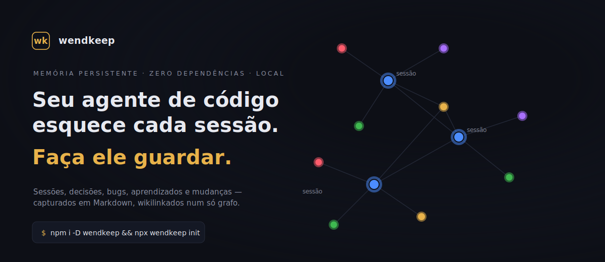

# wendkeep

**Português** · [English](README.md)

> **Seu agente de código esquece cada sessão. O wendkeep faz ele lembrar — no cofre Obsidian que você já usa.**

[](https://www.npmjs.com/package/wendkeep)


[](docs/index.pt.html)

**No grafo:** 🔵 sessão · 🟣 decisão · 🔴 bug · 🟢 aprendizado · 🟡 mudança — cada nota, com backlink.

**Um harness de memória persistente para agentes de código, construído sobre o seu cofre Obsidian.** Cada sessão do Claude Code e do Codex é capturada turno a turno em Markdown local — o `init` wira os hooks dos dois agentes (no Codex, valendo depois que você aprovar o prompt de confiança dele); o `import` importa as sessões passadas de qualquer um dos dois — com rastreio de tokens/custo, decisões, bugs e aprendizados extraídos automaticamente, e uma camada de memória curada injetada de volta no início da próxima sessão. Sobre esse núcleo de memória fica um **ciclo de mudança** nativo e sem dependências (spec → change → TDD → archive com gate por sensor) que mantém intenção, trabalho e prova wikilinkados num só grafo. 100% local, open‑core.

```bash
npm i -D wendkeep && npx wendkeep init      # captura a partir da próxima sessão
npx wendkeep import                          # importa sessões passadas do Claude + Codex
```

**▶ Demo interativo:** [`docs/index.pt.html`](docs/index.pt.html) — uma página autocontida com o herói de grafo vivo. Ele vive no [repositório GitHub](https://github.com/rogersialves/wendkeep/tree/main/docs) (o tarball do npm leva só o runtime), então clone ou baixe o `docs/` pra abrir local ou servir em qualquer host estático. A imagem acima é um render estático dele.

> **De um cofre de produção real** (`npx wendkeep stats`): **308** sessões · **1.696** prompts · **US$ 4.836** capturados em **46 dias ativos** (jan–jul 2026) · **15** modelos — cada uma delas uma nota no grafo.

> Extraído de um sistema em uso diário de produção: o motor de captura, o rastreio de custo e a fiação do grafo são testados em batalha; o instalador multiplataforma (`wendkeep init`) e o ciclo de mudança nativo são as partes mais novas. Veja [`docs/`](https://github.com/rogersialves/wendkeep/tree/main/docs) para a estratégia e o log de decisões do projeto.

---

## O problema: o contexto morre quando a janela fecha

Decisões, becos sem saída, o motivo de você ter escolhido X em vez de Y — some na próxima sessão. As peças pra resolver existem, mas espalhadas (qmd‑sessions, memsearch, Nexus, hooks feitos à mão). O wendkeep entrega tudo num pacote turnkey que escreve num grafo de conhecimento **dentro do cofre Obsidian que você já usa** — sem setup manual, sem snapshot pra manter sincronizado.

| | |
|---|---|
| **Captura** — cada turno, no disco | Os hooks `SessionStart` / `Stop` escrevem cada sessão numa nota Markdown datada: prompts, iterações, arquivos tocados, wikilinks. |
| **Deriva** — decisões, bugs, aprendizados | Puxados do transcript pra notas próprias, com backlink pra sessão. Seu histórico fica navegável, não arquivístico. |
| **Recall** — injetado de volta | Um `CORE` + `DIGEST` com budget capado e todas as changes abertas são injetados no agente no próximo `SessionStart`. Ele retoma de onde parou. |
| **Custo** — quanto tudo custou | Preço por modelo, ciente de cache, por sessão — mais `cost --trend` com projeção run‑rate no cofre inteiro. |
| **Multi‑agente** — um cofre, os dois agentes | O `init` wira os hooks de sessão no `.claude/settings.json` *e* no `.codex/hooks.json`, e cada nota é marcada com o agente que a escreveu: o Claude Code é detectado pelo ambiente dele, qualquer outro é registrado como Codex. Um grafo só, esteja você em qual agente estiver. |
| **Local‑first** — sem nuvem, sem conta | Tudo é Markdown puro no seu disco. Um MCP opcional (`@bitbonsai/mcpvault`) deixa o agente ler/escrever o cofre. |

## Requisitos

- Node.js ≥ 18
- Um agente de código com hooks. O `init` wira o **Claude Code** e o **Codex** automaticamente — no Codex ele wira os sete hooks que o modelo de eventos de lá suporta, e eles nascem *Untrusted*, então aprove o "Hooks need review" no primeiro startup (veja [Notas & roadmap](#notas--roadmap))
- Obsidian (pra ver o grafo) — opcional, mas é o ponto

## Instalar & configurar

```bash
# no seu projeto
npm install --save-dev wendkeep   # ou: npm install -g wendkeep
npx wendkeep init
```

O `wendkeep init` é interativo e **idempotente**. Ele:

1. Cria a taxonomia de pastas do cofre e um `README.md` templado (cofre padrão: `<projeto>/.<nome-do-projeto>-vault`, ex.: `.MeuApp-vault`; sobrescreva com `--vault`).
2. Grava um vínculo provider-neutral **`.wendkeep.json`** na raiz do projeto e o marcador correspondente `.brain/PROJECT.json` no cofre, e faz merge dos hooks de sessão no **`.claude/settings.json`**. O vínculo é provider-neutral de propósito: qualquer agente resolve o mesmo cofre pelo `cwd` da sessão, sem variável global da máquina. Registros antigos em `.claude/settings.json` são adotados automaticamente.
3. Wira os hooks de sessão do Codex em **`.codex/hooks.json`** — sete dos doze: `brain-inject` + `session-start` no `SessionStart`, `session-ensure` + `change-context` no `UserPromptSubmit`, `session-stop` + `change-nag` no `Stop`, `subagent-stop` no `SubagentStop`, sempre na forma `npx wendkeep hook <name>`. Os outros cinco ficam de fora por falta de payload, ferramenta ou evento equivalente no Codex: `change-guard` (gate `PreToolUse` que lê `tool_input.command`; no `exec` do Codex o `tool_input` existe, mas como string crua em vez de objeto — o gate degradaria para liberar tudo, falhando *aberto*), `change-warn` (*nudge* `PostToolUse` que resolve `tool_input.file_path`, campo que o envelope do `apply_patch` não carrega — não há o que resolver nem o que barrar), `plan-capture` (não existe `ExitPlanMode`; o `update_plan` é a lista de TODO em andamento, não uma aprovação), `decision-capture` (`AskUserQuestion` é ferramenta só do Claude) e `task-log` (`TaskCompleted` não está no enum de eventos do Codex). O merge é não‑destrutivo, na mesma disciplina do `settings.json`: reconhece o grupo já wirado e não duplica em re‑init, preserva hooks de terceiros, salva um `.bak`, e o `--force` atualiza `timeoutSec`/`statusMessage` no lugar; um `.codex/hooks.json` ilegível não é tocado e o merge vai pro `.codex/hooks.json.new`. **O Codex enumera todo hook como Untrusted e só executa depois que você aprovar o "Hooks need review" no startup — o `init` não consegue pré-aprovar**, e ele imprime um aviso sobre isso. Quem já tinha hooks wendkeep no Codex escritos à mão leva um prompt de re-revisão: o `init` migra a chave legada `timeout` (que o Codex não rejeita nem lê, caindo no default de 600s) pra `timeoutSec`, e isso muda a identidade com hash do hook.
4. Adiciona o servidor MCP **`wendkeep-vault`** ao `.mcp.json` pro agente ler/escrever o cofre. Pule com `--no-mcp` — ex.: quando o agente já tem um MCP de cofre. (`--no-mcp` pula *só o MCP do próprio wendkeep*; os MCPs de companion seguem `--companions`.)
5. Oferece fixar plugins/MCP **companion** (múltipla escolha; **nenhum** pré-marcado — o wendkeep é um harness neutro e não presume plugin de terceiro). Cada um é wirado do jeito mais agnóstico que suporta:
   - **`context-mode`** — otimizador de contexto + memória FTS5, wirado como plugin do Claude Code. Ele traz o próprio servidor MCP, então o wendkeep de propósito não adiciona entrada no `.mcp.json` (registrar os dois subia dois servidores ao mesmo tempo). Em agentes não‑Claude, adicione o MCP à mão: `npx -y context-mode`.
   - **`understand-anything`** — grafo de domínio do projeto, via um hook `understand-inject` no SessionStart que injeta o grafo quando gerado.
   - **`caveman`** — modo de compressão de tokens; roda seu próprio instalador cross‑agent em agentes não‑Claude.
   - **`dotcontext`** — *legado, não recomendado, e oculto do seletor.* O loop a2 nativo do wendkeep (`change` / `verify` / gate) já faz o trabalho dele, então instalar **duplica o harness**. Alcançável só via um `--companions dotcontext` explícito, pra quem já usa (ajuste com `--dotcontext-mcp` / `--dotcontext-hooks`).

   Controle com `--companions <csv>` ou `--no-companions`. A camada de plugin do Claude Code (`extraKnownMarketplaces` + `enabledPlugins`) é wirada como bônus onde o companion tiver uma.
6. Instala um **sistema de cores** no `.obsidian/` do cofre: um snippet CSS que colore notas por tipo (sessão/decisão/bug/aprendizado, via as `cssclasses` que os hooks emitem) mais grupos de cor do grafo por pasta. Merge não‑destrutivo em `appearance.json`/`graph.json`; pule com `--no-colors`.
7. Semeia a **camada de memória curada**: `.brain/CORE.md` (a camada quente curada à mão, com as 3 seções obrigatórias) e `.brain/COMPACTION_PROTOCOL.md` (o guia do protocolo). As camadas automáticas (`DIGEST.md`, `index.jsonl`) são geradas pelos hooks. Valide a camada curada com `wendkeep validate-memory` (cap 25 linhas, 3 seções, sem segredos/PII).
8. Semeia a **camada de definições + skills**: `.brain/agents/` + `.brain/skills/` (fonte da verdade versionada), incluindo as skills de processo nativas `wk-workflow` / `wk-tdd` / `wk-debugging` / `wk-brainstorming` / `wk-planning` / `wk-verify` (algumas trazem templates, ex.: o `verdict-template.json` + prompt de revisor da `wk-verify`). O `init` roda o `wendkeep sync-defs` pra você, entregando as skills em `.claude/skills/` e `.agents/skills/`, e as definições de agent (`.brain/agents/*.toml`) em `.codex/agents/`, mais uma seção gerenciada no `AGENTS.md` que indexa as skills pro Codex; o `sync-defs --check` detecta cópias defasadas (rode `sync-defs` de novo após editar o `.brain`).
9. Semeia o **ciclo change/spec**: as pastas `07-Specs/` + `08-Mudanças/` e um `wendkeep.sensors.json` nativo — um sensor crítico `memory-validation` (`npx wendkeep validate-memory`) mais um para cada `typecheck` / `test` / `lint` / `build` encontrado no seu `package.json`. Adicione os seus com `wendkeep sensors add`. É o que alimenta o `wendkeep change` / `wendkeep verify` — veja **Ciclo de mudança** abaixo.

```bash
npx wendkeep init --vault "~/vaults/work" --project . --yes   # não-interativo
npx wendkeep init --companions "context-mode,understand-anything" --yes
npx wendkeep init --no-companions --no-mcp --yes              # zero companions, sem MCP do wendkeep
```

### Opções do `init`

| Flag | O que faz |
|---|---|
| `--vault <path>` | Pasta do cofre. Padrão `<projeto>/.<nome-do-projeto>-vault`; o init interativo pergunta. Aponte pra um cofre existente pra instalar nele. |
| `--project <path>` | Raiz do projeto a wirar (padrão: diretório atual). |
| `--locale <pt-BR\|en>` | Idioma do cofre — nomes das pastas, scaffold, skills. O init interativo pergunta; travado no init. |
| `--companions <csv>` | Companions a fixar: `context-mode,caveman,understand-anything` (padrão: **nenhum** — opte explicitamente; `dotcontext` é legado). |
| `--no-companions` | Não fixa nenhum companion. |
| `--no-mcp` | Pula o MCP de cofre **do próprio wendkeep** (`wendkeep-vault`). Os MCPs de companion seguem `--companions`. |
| `--no-colors` | Pula o sistema de cores do Obsidian (snippet `.obsidian` + grupos do grafo). |
| `--yes`, `-y` | Não-interativo; aceita os padrões (pula os prompts de idioma / cofre / companion). |
| `--force` | Sobrescreve os blocos de config do wendkeep existentes. |

Depois abra o cofre no Obsidian, mande um prompt de teste no seu agente e confirme que uma nota aparece em `02-Sessões/…` (ou `02-Sessions/…` num cofre `en`).

### Isolamento por projeto

Cada projeto possui um `.wendkeep.json` com `projectId` estável e caminho do vault. Caminhos
relativos, como `.NutriGymBrain`, partem da raiz do projeto; caminhos absolutos também são
aceitos. Os hooks procuram o vínculo mais próximo subindo a partir do `cwd`. O vault guarda a
mesma identidade em `.brain/PROJECT.json`, e uma divergência bloqueia a escrita. Sem vínculo,
os hooks falham de modo seguro e nunca criam o antigo fallback `~/wendkeep-vault`.

`OBSIDIAN_VAULT_PATH` permanece somente como compatibilidade legada para comandos manuais.
Ele não roteia hooks automáticos do Codex ou Claude, e o vínculo local prevalece sobre uma
variável herdada da máquina.

## Atualizar

Como os hooks vivem dentro do pacote instalado, atualize e rode novamente o `init`
idempotente. Essa etapa cria ou migra o vínculo provider-neutral:

```bash
npm install --save-dev wendkeep@latest
npx --no-install wendkeep init --project . --vault <seu-vault> --yes
npx --no-install wendkeep sync-defs --project . --reseed
npx --no-install wendkeep doctor --project .
```

Reinicie Codex e Claude Code depois de resemear as skills geradas.

## Comandos

| Comando | O que faz |
|---|---|
| `wendkeep init` | Configura o wendkeep num projeto (taxonomia do cofre + settings + MCP + skills). |
| `wendkeep hook <name>` | Roda um hook de sessão; invocado pelo `settings.json` (lê o JSON do agente no stdin). |
| `wendkeep change <sub>` | Ciclo de mudança: `new <slug> [--simple]` / `use <slug>` (troca o foco) / `continue <arquivada> <nova>` / `bind <slug> --session <id>` / `list` (backlog global) / `show <slug>` / `status [slug]` / `done <id> [--change slug]` / `undone <id> [--change slug]` / `relink [--apply] [--json]` (conserta os wikilinks das changes; prévia por padrão) / `diff [slug]` / `archive [slug] [--force]` / `abandon [slug]` (descarta sem ADR). `diff`, `archive` e `abandon` caem na change ativa quando você omite o slug; o `status` pelado lista todas as abertas. |
| `wendkeep verify [--deep] [--change s]` | Roda os sensores das tarefas da change; `--deep` monta o pacote de verificação independente. `--change` mira uma change que não é a ativa. |
| `wendkeep spec <sub>` | Specs vivos: `list` / `show <capability>` / `effective [--change <slug>] [--json]` (contrato vivo + delta; usa a change ativa por padrão) / `migrate` / `rebase [--accept-current]` (para em conflito, a não ser que você aceite o lado do spec vivo). |
| `wendkeep sensors <sub>` | `list` / `add <id> "<comando>"` com `--severity` / `--type` / `--report` / `--name` / `--description` — vê/edita `wendkeep.sensors.json` (JSON Schema incluso). |
| `wendkeep cost [opts]` | Agrega o gasto de IA nas sessões do cofre — total, por modelo, por dia · `--since <data>` · `--top [N]` · `--trend [day\|week\|month]` (+ projeção) · `--write` (gera `00-Custo.md`) · `--json`. |
| `wendkeep cost rebuild [opts]` | Reconstrói custos históricos do transcript principal e subagents via `SESSION_REGISTRY`. Dry-run por padrão; `--apply` grava notas e `.brain/COST_REBUILD.json`. Também `--session <id\|arquivo>` / `--limit n` / `--json`. |
| `wendkeep session list\|show\|use` | Lista o registry multi-sessão, mostra uma conversa ou muda somente o foco humano de `CURRENT_SESSION.md`. |
| `wendkeep stats [--vault P]` | Uma linha compartilhável: sessões · prompts · gasto · período · modelos (`--json`). |
| `wendkeep import [opts]` | **Memória retroativa** — importa sessões passadas de **Claude + Codex** pro cofre (dedup por `session_id`). `--source all\|claude\|codex` / `--stamp-ids` / `--rescan-decisions` / `--from <dir>` / `--codex-from <dir>` / `--since d` / `--limit n` / `--dry-run` / `--json`. |
| `wendkeep dashboard [--force]` | (Re)gera os Bases filtrados por pasta + o MOC `00-Dashboard`. |
| `wendkeep note new --type bug\|learning "<título>"` | Cria uma nota derivada **numerada** (`BUG-`/`APR-NNNN`) na pasta do mês e imprime o caminho no cofre. `--date YYYY-MM-DD`. |
| `wendkeep renumber-decisions` | Renumera `04-Decisões` pra `ADR-NNNN-<slug>` em ordem cronológica, tira as notas de subpastas legadas `DIA N` pra pasta do mês e reescreve os wikilinks. Prévia por padrão; `--apply` / `--json`. |
| `wendkeep renumber-bugs` | Idem pra `05-Bugs` → `BUG-NNNN-<slug>`. |
| `wendkeep renumber-learnings` | Idem pra `06-Aprendizados`/`06-Learnings` → `APR-NNNN-<slug>`. |
| `wendkeep lesson add "t" "l"` | Registra uma lição local do projeto (injetada no próximo SessionStart). |
| `wendkeep sync-defs` | Copia `.brain/agents\|skills` pro projeto (`.codex/agents`, `.claude/skills`, `.agents/skills`); `--check` detecta drift, `--reseed` ressemeia as skills `wk-*` com os seeds da versão instalada. |
| `wendkeep validate-memory [path]` | Valida `.brain/CORE.md` (cap 25, 3 seções, sem segredos/PII). |
| `wendkeep doctor [--vault P]` | Roda um check de saúde do cofre (integridade de sessões, registry, links). |
| `wendkeep --version` / `--help` | Versão / uso. |

As notas de sessão usam um único snapshot vivo `## Agentes, tokens e custos`. Os hooks do agente principal e dos subagents recompõem o bloco atomicamente, incluindo custo, dimensões de tokens, reasoning e effort por modelo/origem.

## Memória retroativa (`import`) — instale hoje, lembre de ontem

Instale o wendkeep num projeto existente e ele só lembra sessões **a partir de agora**. O `wendkeep import` conserta isso: um comando importa as sessões passadas de **Claude & Codex** do projeto pro cofre — dedup, datadas, com custo — então o grafo começa cheio, não vazio. Reconstrói cada transcript como uma nota de sessão completa na pasta datada **real** — frontmatter (taggeado com o provedor real), um bloco de iteração por turno, custo + telemetria de subagents, notas derivadas de decisão/bug/aprendizado, encerramento finalizado. Um replay offline do fluxo de captura vivo, então uma nota importada é indistinguível de uma capturada.

```bash
wendkeep import --vault .meuprojeto-vault --dry-run   # prévia do que seria importado (os dois agentes)
wendkeep import --vault .meuprojeto-vault             # escreve as notas
wendkeep import --vault .meuprojeto-vault --source codex   # só Codex
```

- **Os dois agentes por padrão** (`--source all`). As sessões do Claude vêm de `~/.claude/projects/<slug>/`; os rollouts do Codex de `~/.codex/sessions/**`, escopados pro projeto pelo `cwd` gravado em cada sessão (insensível a case e separador, subpastas inclusas). Estreite com `--source claude` / `--source codex`.
- Toda nota grava o **`session_id`** e o **`provider`** no frontmatter (captura live e import iguais). Carimbe notas antigas com `wendkeep import --stamp-ids` (preenche o id a partir do registry; idempotente).
- **Dedup** por `session_id` contra o `SESSION_REGISTRY` do cofre **e** o frontmatter das notas existentes — só importa sessões ausentes e nunca sobrescreve. Rodar de novo é no‑op.
- **`--from <dir>`** / **`--codex-from <dir>`** apontam as pastas de transcript explicitamente (use se o caminho auto‑derivado errar). Também: `--since <data>`, `--limit <n>`, `--rescan-decisions`, `--json`.
- Depois de importar, o `wendkeep cost` agrega seu histórico inteiro — retroativamente, nos dois agentes.

## Notas derivadas — numeradas como ADRs (`note new`, `renumber-*`)

Decisões, bugs e aprendizados são **notas derivadas**: vivem na pasta do mês da sua árvore (`<pasta>/<ano>/<MM-MMM>/`) e carregam um id sequencial — `ADR-0001`, `BUG-0001`, `APR-0001`. Uma olhada já diz o que a nota é e onde ela cai na história do projeto. Sem subpasta por dia: uma pasta `DIA N` com uma nota só é ruído, e esconde a nota da busca por pasta.

**Criando uma** (nunca escreva o arquivo à mão — o comando é dono do número, da pasta e do frontmatter):

```bash
wendkeep note new --type bug "login dá 500 quando o token expira no meio do refresh"
# → 05-Bugs/2026/07-JUL/BUG-0007-login-da-500-quando-o-token-expira-no-meio-do-refresh.md

wendkeep note new --type learning "regex sem /g só retorna o primeiro match"
# → 06-Aprendizados/2026/07-JUL/APR-0003-regex-sem-g-so-retorna-o-primeiro-match.md
```

Ele imprime o caminho criado, numera a partir do máximo atual (varredura recursiva), arquiva na pasta do mês de hoje (`--date YYYY-MM-DD` pra sobrescrever) e linka a sessão ativa em `source:` pro grafo seguir conectado. Os agentes recebem essa regra injetada no SessionStart — chamam o comando em vez de chutar um nome de arquivo.

**Migrando um cofre existente.** Notas criadas antes da `0.41.0` têm nome com prefixo de data (`2026-07-16-bug-<slug>.md`) e podem estar em subpastas legadas `DIA N`. Um comando por árvore renumera cronologicamente, sobe as notas pra pasta do mês e reescreve todos os wikilinks do cofre:

```bash
# Bugs — 05-Bugs → BUG-NNNN
wendkeep renumber-bugs                  # prévia: imprime cada de → para, não escreve nada
wendkeep renumber-bugs --apply          # migra

# Aprendizados — 06-Aprendizados → APR-NNNN
wendkeep renumber-learnings             # prévia
wendkeep renumber-learnings --apply     # migra

# Decisões — 04-Decisões → ADR-NNNN (desde a 0.30.0)
wendkeep renumber-decisions             # prévia
wendkeep renumber-decisions --apply     # migra
```

- **Prévia é o padrão.** Nada é escrito até o `--apply` — leia a lista `de → para` primeiro; é ali que um slug estropiado aparece, antes de tocar seus arquivos.
- **Uma árvore por vez, de propósito.** Não existe `renumber-all`: cada pasta é migrada e revisada por conta própria.
- **A ordem é cronológica**, derivada da data da nota (frontmatter → prefixo do nome → pasta), então `BUG-0001` é de fato o bug mais antigo — não o primeiro que o scanner leu.
- **Wikilinks são reescritos no cofre inteiro** (forma com path completo e por basename, aliases preservados), o `type`/`bug:`/`apr:`/H1 do corpo são normalizados e pastas `DIA` esvaziadas são removidas. **Idempotente**: um segundo `--apply` não renomeia nada. Feche o Obsidian durante a migração, e commite o cofre antes se ele estiver sob git.

## Ciclo de mudança — o loop a2 (spec‑driven, nativo)

Além de capturar sessões, o wendkeep é um **harness**: um loop nativo e sem dependências que mantém *intenção* (specs), *trabalho* (changes) e *prova* (sensores) juntos no cofre, wikilinkados no grafo Obsidian.

```
explore → propose → apply (TDD) → verify → archive
```

- **Propose** — `wendkeep change new <slug>` faz o scaffold de `08-Mudanças/<slug>/` (`proposta.md`, `design.md`, `tarefas.md`; o `--simple` pula o design). A change vira a *atual* global; `change use <slug>` troca o foco e `change continue <arquivada> <nova>` cria uma continuação auditável. Várias changes podem ficar abertas: hooks e `change list/status` mostram todas as pendências, enquanto comandos sem `--change` usam somente a atual. Quando a change declara `spec_impact: required`, você mesmo escreve o delta em `specs/<capability>/spec.md` — não há placeholder pra apagar.
- **Apply** — implemente cada tarefa de `tarefas.md`. Taggeie a tarefa que precisa de prova de máquina com `[sensor:<id>]` — um sensor por tarefa (a tarefa carrega um só; quebre em duas se precisar de dois) — e o requisito que ela satisfaz com `[req:<ID>]`, dos quais a tarefa pode declarar vários.
- **Verify** — `wendkeep verify` roda os sensores que suas tarefas declararam (do `wendkeep.sensors.json` na raiz do projeto) e grava `evidencia.json`. Um vermelho crítico falha o gate; um vermelho `warning` é aviso. O `verify --deep` monta o pacote autocontido de verificação (contrato vivo + delta desta change). Toda change precisa de um `verdict.json` pra arquivar; quando ela não declara `[req:]`, o próprio `verify --deep` grava um verdict trivial.
- **Archive** — `wendkeep change archive <slug>` faz **gate** na evidência (bloqueia a não ser que todo sensor crítico declarado esteja verde), promove o delta de cada capability (`ADDED`/`MODIFIED`/`REMOVED`) pro `07-Specs/<capability>.md` vivo, move a change pro `_arquivo/` e cunha um ADR em `04-Decisões/`.

> O gate bloqueia a não ser que o scaffold esteja preenchido, nenhuma tarefa aberta, evidência fresca e todo requisito declarado coberto. **O `--force` dispensa exatamente uma dessas — a checagem de tarefa aberta — e é decisão do humano, nunca do agente.** Scaffold não preenchido, sensor crítico vermelho, evidência stale, requisito órfão ou verdict ausente bloqueiam de qualquer jeito.

O `wendkeep init` também semeia **skills de processo nativas** (`wk-workflow`, `wk-tdd`, `wk-debugging`, `wk-brainstorming`, `wk-planning`, `wk-verify`) no `.brain/skills` do cofre e as entrega em `.claude/skills/` e `.agents/skills/` — a camada do *como*, zero‑dep. O Codex recebe as definições de agent (`.brain/agents/*.toml` → `.codex/agents/`) mais uma seção gerenciada no `AGENTS.md` que indexa as skills. Cada skill carrega metadados de hash/versão da fonte; o `doctor` avisa quando é preciso ressemear e reiniciar o agente. Companions opcionais (`context-mode`, `dotcontext`, `understand-anything`, `caveman`) ficam como camada extra opt‑in.

### O loop em cinco minutos

```bash
npx wendkeep init --yes                        # cofre + hooks + sensores + skills
npx wendkeep change new dark-mode              # proposta/design/tarefas — a change fica ativa
```

Edite o `tarefas.md` — marque a prova e o requisito por tarefa:

```markdown
- [ ] 1.1 o toggle persiste entre sessões [req:UI-1] [sensor:tests]
```

Declare a capability na `proposta.md` (`specs: [ui]`) e escreva o delta dela só em
`08-Mudanças/<slug>/specs/ui/spec.md`. O `07-Specs` é gerado/read-only. Então:

```bash
npx wendkeep change status                     # todas as changes abertas + tarefas pendentes
npx wendkeep change list                       # o mesmo backlog, mais as arquivadas
npx wendkeep change status dark-mode           # uma tela pra uma change: specs / tarefas / sensores / veredito
npx wendkeep spec effective --change dark-mode # contrato vivo + delta desta change
npx wendkeep change done 1.1                   # marca uma tarefa pela CLI
npx wendkeep verify                            # roda os sensores declarados -> evidencia.json
npx wendkeep verify --deep                     # monta o pacote de verificação
# a skill wk-verify (passe fresco, read-only) grava o verdict.json
npx wendkeep change diff                       # prévia do que vai cair no 07-Specs
npx wendkeep change archive dark-mode          # gate: sensores + verdict + nenhuma tarefa aberta
```

O archive promove o delta pro `07-Specs/ui.md` gerado, cunha um ADR, e o grafo do Obsidian
agora liga *sessão ↔ change ↔ requisito ↔ decisão*. Uma change que não nomeia nenhum
`[req:]` ainda roda o `verify --deep`, mas pula o passe de leitura do `wk-verify`: o próprio
comando grava um verdict trivial e o gate de sensores é a prova real.

## Como funciona

```
sessão do agente ──hooks──▶ wendkeep ──▶ Markdown no cofre ──▶ índice .brain + grafo Obsidian
   (Claude/Codex)           (Node)      (02-Sessões/…)         (CORE+DIGEST, backlinks)
```

O settings.json do agente aponta cada hook pra `npx wendkeep hook …`; no Claude Code, os hooks do ciclo de mudança rodam o script instalado direto (`node` em `${CLAUDE_PROJECT_DIR}/node_modules/wendkeep/hooks/<name>.mjs`) quando o pacote está presente local, pulando uma resolução do npx a cada evento. O `.codex/hooks.json` usa sempre a forma `npx` — o `${CLAUDE_PROJECT_DIR}` não existe no Codex — com chaves de evento em PascalCase e o timeout em `timeoutSec`. No `Stop`, o wendkeep parseia o transcript, anexa o turno, atualiza a tabela de tokens/custo e (idempotentemente) emite qualquer nota de decisão/bug/aprendizado. No `SessionStart` — startup, `/clear` e `/compact` — o `brain-inject` injeta a memória curada (CORE + DIGEST), todas as changes abertas com suas pendências, o marcador global da change atual, as lições do projeto e o roteador `<wk_process>`. Claude, Codex ou outro agente podem assim retomar trabalho iniciado em outro lugar sem ocultar o restante do backlog.

O **gate** do archive bloqueia a não ser que: o scaffold da change esteja preenchido (G0), nenhuma tarefa esteja aberta (G1), todo sensor crítico declarado esteja verde (com evidência fresca) e exista um `verdict.json` presente e atual. O `--force` dispensa só o G1 — o G0 é inescapável por design (uma change placeholder forçada uma vez cunhou um ADR falso), e nenhuma flag torna verde um sensor vermelho ou um verdict ausente. O agente é instruído a nunca usar por conta própria.

## Notas & roadmap

- **Nomes das pastas do cofre são em Português por padrão** (`02-Sessões`, `04-Decisões`, …). Passe `wendkeep init --locale en` pra um cofre em inglês (`02-Sessions`, `04-Decisions`, scaffold/skills em inglês). O locale é uma propriedade do cofre, travada no init; os parsers são bilíngues, então conteúdo misto nunca quebra.
- **Busca é scoring por keyword/frontmatter**, não embeddings on‑device (isso está no roadmap).
- **Formatos de transcript são internos ao agente** e podem mudar entre versões; o parsing é isolado mas pode precisar de atualizações.
- O instalador wira settings do **Claude Code** + **`.codex/hooks.json`** + `.mcp.json`. **No Codex vão sete dos doze hooks** — os outros cinco não têm payload, ferramenta ou evento equivalente: `change-guard` (gate `PreToolUse` que lê `tool_input.command`, mas o `exec` do Codex carrega `tool_input` como string crua, não objeto — o gate falharia *aberto*), `change-warn` (*nudge* `PostToolUse` que resolve `tool_input.file_path`, campo ausente do envelope do `apply_patch` — não há o que resolver nem o que barrar), `plan-capture` (não existe `ExitPlanMode`; o `update_plan` é lista de TODO em andamento, não aprovação), `decision-capture` (`AskUserQuestion` é ferramenta só do Claude) e `task-log` (`TaskCompleted` não está no enum de eventos do Codex). Ou seja: captura de sessão, custo e memória funciona igual, mas os avisos de mudança ligados a ferramenta e a captura de plano/decisão/tarefa são só do Claude. Os hooks também só rodam depois que você aprovar o "Hooks need review" — o `init` não consegue pré-aprovar. Pra sessões Codex anteriores ao wiring, use `import --source codex`.
- **Os hooks do Codex nascem Untrusted.** Eles são enumerados, mas não executados, até você aprovar o "Hooks need review"; o `init` não consegue pré‑aprovar (o `--dangerously-bypass-hook-trust` vale só por invocação e não grava nenhum trusted hash). A confiança é atrelada à identidade do hook, então quem tinha hooks wendkeep do Codex escritos à mão antes da `0.46.0` — que rodavam no default de 600s por usarem `timeout` em vez de `timeoutSec` — paga uma re‑revisão única depois que o `init` corrige a chave. Isso é esperado, não é regressão.

---

## Pare de reexplicar seu código toda manhã

```bash
npm i -D wendkeep && npx wendkeep init
```

**[Instalar do npm](https://www.npmjs.com/package/wendkeep)** · **[Deixar uma star no GitHub](https://github.com/rogersialves/wendkeep)** — MIT · open‑core · seus dados nunca saem do seu disco.

## Licença

MIT
